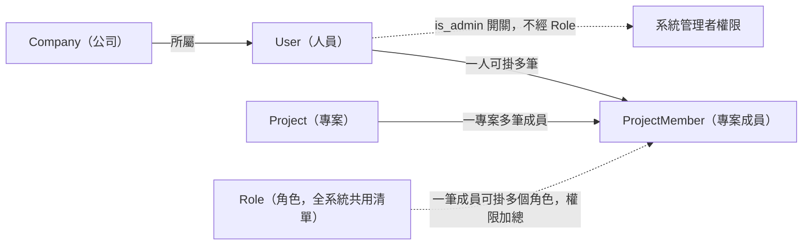
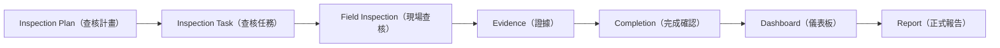
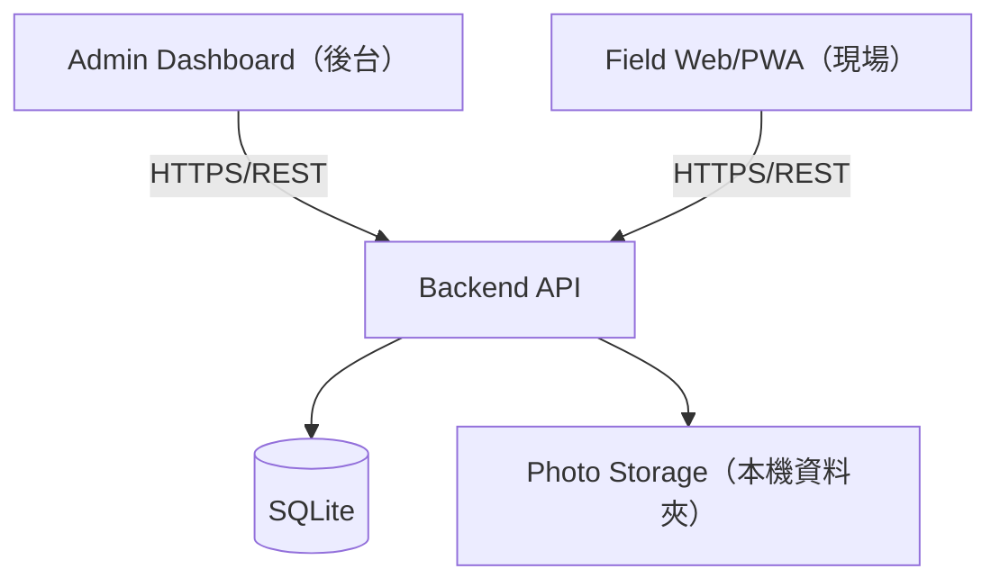
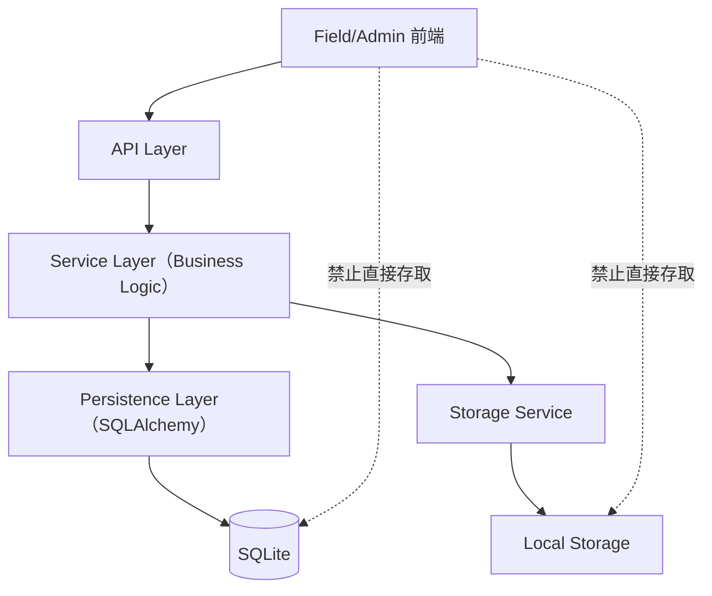
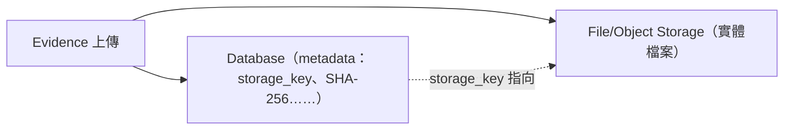
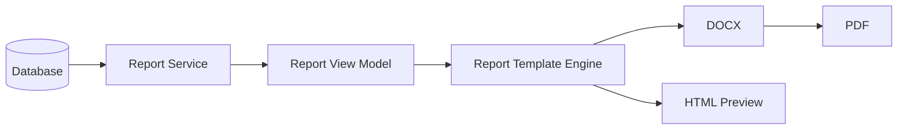
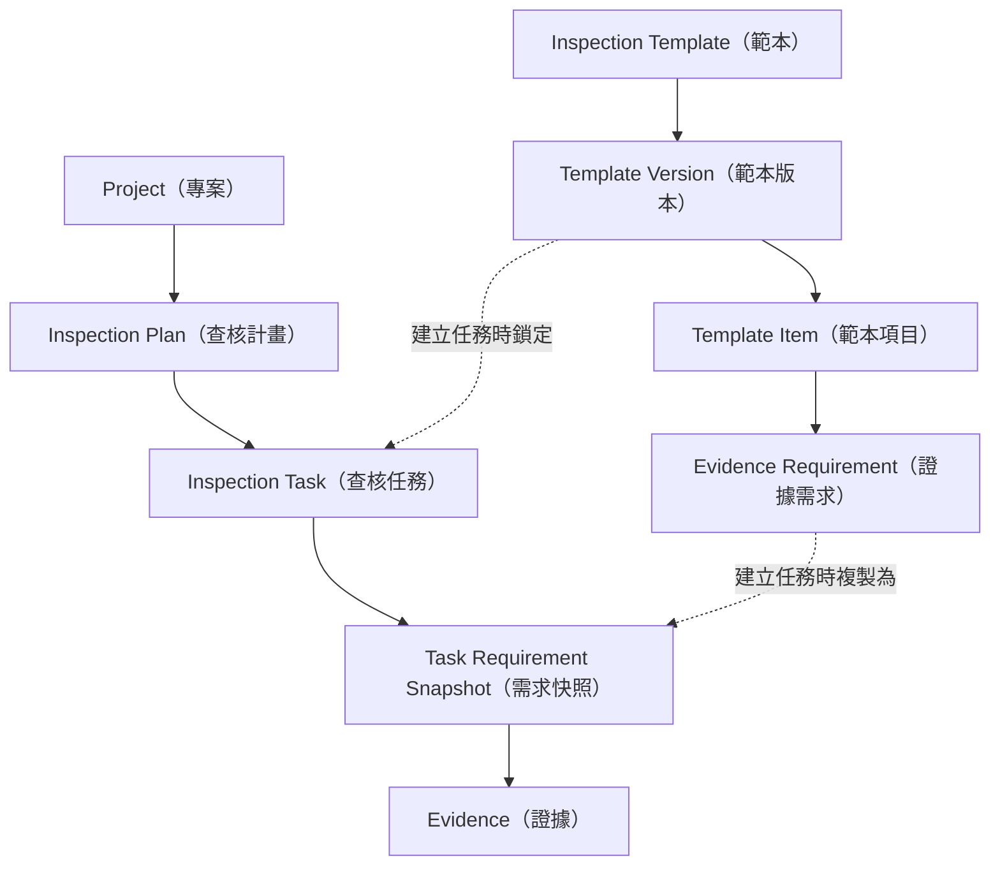
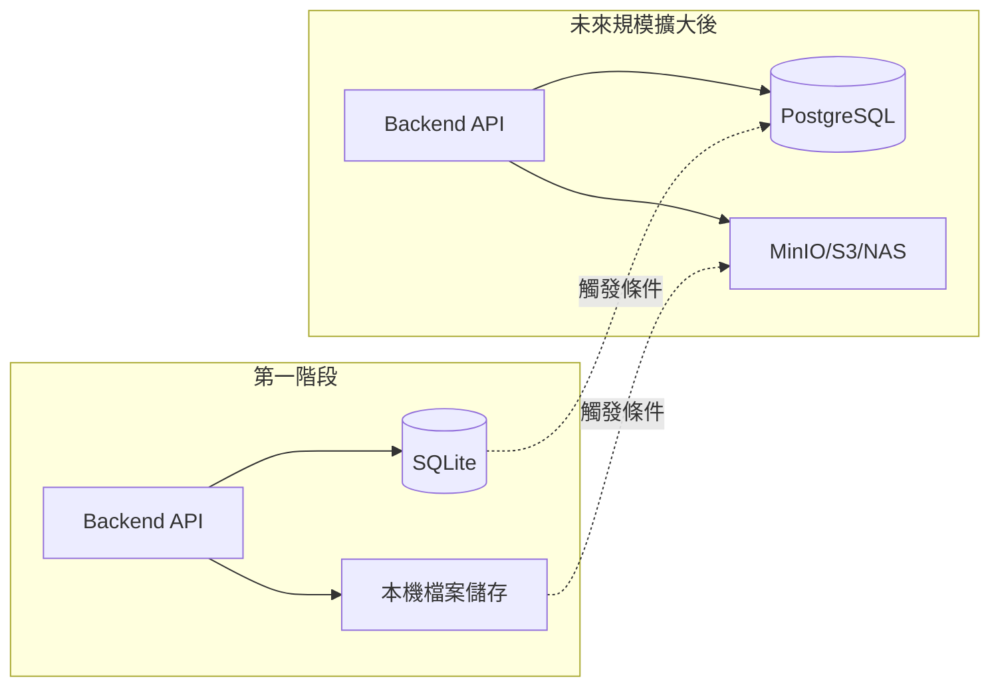
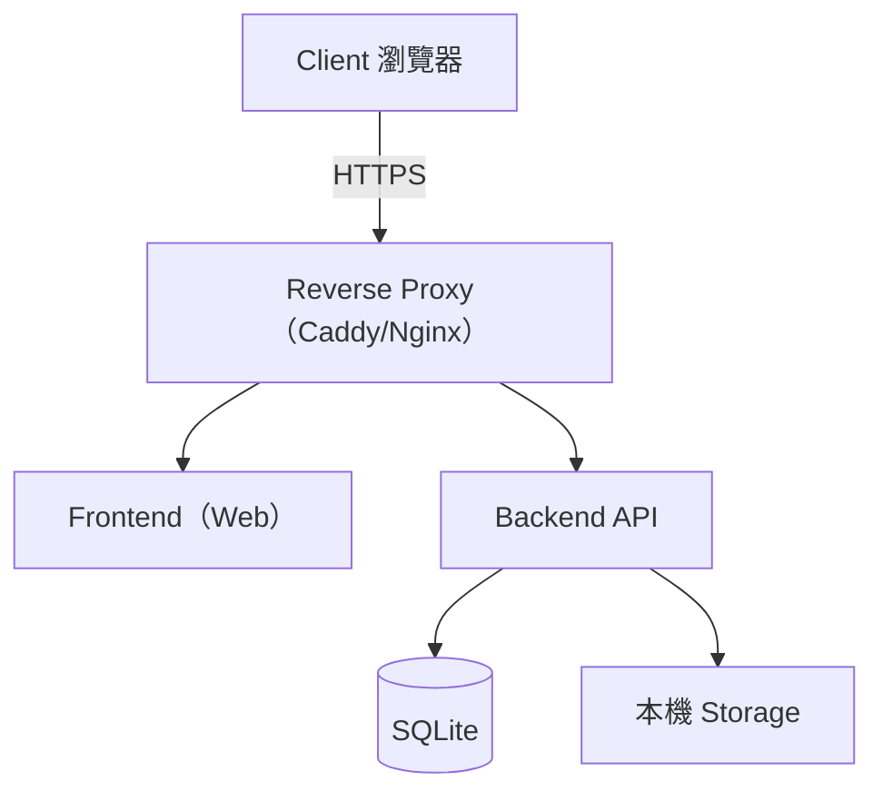

# 系統總覽（Overview）

**這份文件回答**：InspectFlow 要解決什麼問題、服務誰、第一階段做到哪裡、整體架構長什麼樣子？
**什麼時候讀**：第一次接觸系統，或規劃功能與確認範圍時。

## 目的

InspectFlow 要避免照片、查核項目與說明分散，造成證據難核對、進度難掌握、報告難產出的問題。來源沒有調查現行流程，本段描述的是系統要解決的風險。系統串起規劃、現場查核、後端完成驗證、儀表板與正式報告（依據：架構基準 §1）。

`InspectFlow` 這個名稱由 `Inspection`（查核）與 `Flow`（流程）組合而成，代表本系統管理的是完整的工程查核流程，而非單純的拍照工具（依據：架構基準 §0.1）。

`Dashboard` 用來監控；DOCX／PDF 才是正式交付與歸檔產物（依據：架構基準 §20.1、§20.22）。Pilot 還要驗證現場操作、排程、網路、容量、備份與報告產製時間（依據：架構基準 §31）。

現場流程**應**在手機與平板上容易操作；Pilot 要實測現場裝置與網路（依據：架構基準 §5.3、§13A.13、§31）。

### 核心價值

架構基準文件列出的核心價值（依據：架構基準 §1）：

1. 降低現場工程師的操作負擔。
2. 統一查核與照片蒐集格式。
3. 讓照片與查核項目建立明確關聯。
4. 讓後台可以即時掌握完成度。
5. 保存可追溯的歷史查核資料。
6. 為未來 PostgreSQL、NAS／MinIO／S3、離線模式與更完整的工程生命週期系統保留演進空間。

## 服務對象

系統內部角色與後台／現場的職責分工（依據：架構基準 §6.1–6.2）如下：

| 角色 | 職責 |
|---|---|
| 系統管理者（Admin，人員身上的開關，不是角色） | 管理系統設定、人員、公司、角色定義；可直接查看、修改所有專案（依據：負責人決定（#63，2026-09-26）；取代架構基準 §17 的範例矩陣，見 [KD-24](03-decisions-and-stack.md#kd-24)）。 |
| 專案角色（可自訂，掛在專案成員上） | 依指派的角色決定在該專案能做什麼，例如建立查核計畫、指派工程師、批次產生任務、監看完成度、審閱照片並產生報告，或唯讀存取；一個人在同一專案可同時擁有多個角色，權限加總（依據：負責人決定（#63，2026-09-26）；取代架構基準 §17 的範例矩陣，見 [KD-26](03-decisions-and-stack.md#kd-26)、[KD-27](03-decisions-and-stack.md#kd-27)）。 |
| 現場工程師（Inspector / Field Engineer） | 查看今日指派任務，依要求拍照、填寫必要說明，並將任務標記完成；屬於現場查核這類專案角色的典型職責（依據：架構基準 §6.1）。 |

系統採「系統管理者開關＋可自訂的專案角色」模式，取代原本架構基準 §17 例示的四個固定角色 `ADMIN`、`COORDINATOR`、`INSPECTOR`、`VIEWER`；首次安裝預建三個範本角色：內業整理、現場查核、唯讀，之後都可以改名、改內容，也可以刪除（依據：負責人決定（#63，2026-09-26）；取代架構基準 §17，見 [KD-24](03-decisions-and-stack.md#kd-24)、[KD-26](03-decisions-and-stack.md#kd-26)）。權限機制的細節（權限＝資料 × 動作、角色掛在專案成員上、安全機制）已裁定，見 [05-open-questions.md](05-open-questions.md) [OQ-08](05-open-questions.md#oq-08)（已裁定）。

### 人員、公司與權限的實體關係



- `Company` 與 `User` 是一對多：人員所屬 `Company` 可隨時修改，見 [KD-23](03-decisions-and-stack.md#kd-23)。
- `ProjectMember` 是 `User`、`Project`、`Role` 三者的關聯實體：同一人在同一 `Project` 下可掛多個 `Role`，權限加總，見 [KD-27](03-decisions-and-stack.md#kd-27)。
- `Role` 全系統共用一份清單，可自訂、可刪除，修改時立即影響所有持有者，見 [KD-26](03-decisions-and-stack.md#kd-26)。
- 系統管理者（`is_admin`）是 `User` 身上的開關，不透過 `Role` 授予，見 [KD-24](03-decisions-and-stack.md#kd-24)。

除了系統內部角色之外，正式報告（DOCX／PDF）另有一群**文件收受方**：業主、監造單位、品管、政府標案審查方，以及文件歸檔／管理系統，他們不一定是系統的登入使用者，而是報告的閱讀與簽核對象 （依據：架構基準 §20.1、§20.12–20.13）。設計現場與後台流程時，需要區分「誰是系統使用者」與「誰只是最終文件的收受者」。

## 查核生命週期

系統圍繞以下生命週期建構（依據：架構基準 §0.1、§20.1）：



依據：架構基準 §0.1、§1

- 生命週期的起點是 `Inspection Plan`，終點是正式 `Report`，不是 `Dashboard`。
- `Dashboard` 只是監控介面；`Report`（DOCX／PDF）才是對業主、監造與政府機關具有正式意義的產出。
- 圖中混合流程步驟與資料實體；主要名詞見 [04-glossary.md](04-glossary.md)。

## 第一階段（MVP）範圍

第一階段的目標是完成一個完整閉環，不是打造大平台（依據：架構基準 §1）。架構基準文件以開發階段順序具體定義了這個範圍（依據：架構基準 §30）：

- **Phase 0 — Repository / Skeleton**：專案骨架、健康檢查端點。
- **Phase 1 — Database Foundation**：SQLAlchemy + Alembic + SQLite；`User`、`Project`、`Template`、 `TemplateVersion`。分成兩段：第一段是基礎設施加上 `User`、`Project`；第二段是 `Template`、`TemplateVersion`，等 [G-01](05-open-questions.md#g-01) 裁定後再做（依 [OQ-22](05-open-questions.md#oq-22)；依據：負責人決定（#46，2026-09-26），架構基準無對應章節）。
- **Phase 2 — Authentication**：登入 / 登出 / 目前使用者 / 角色。
- **Phase 3 — Template System**：`Template`、`TemplateVersion`、`TemplateItem`、`EvidenceRequirement`。
- **Phase 4 — Inspection Planning**：`InspectionPlan`、`InspectionTask`、任務需求快照，並由起訖點與 間距自動產生任務。
- **Phase 5 — Field UI**：今日任務、任務詳情、證據檢查清單、狀態。
- **Phase 6 — Photo Upload & Field Evidence Editor**：拍照、非破壞式編輯、上傳、儲存、Evidence 紀錄。
- **Phase 7 — Task Completion Validation**：必要證據 vs. 已上傳證據的伺服器端驗證。
- **Phase 8 — Admin Dashboard**：今日工作量、完成數／完成率、工程師與專案進度。
- **Phase 9 — Formal Report Delivery**：Report View Model、DOCX 範本、DOCX／PDF 與版次資料。MVP **必須**保存範本版本、文件編號、版次、產製者與時間、兩種檔案鍵、資料快照與 SHA-256；已核發檔案**不得**覆蓋（依據：架構基準 §20.22、§30 Phase 9）。完整簽核流程**得**先用空白簽名欄簡化；正式流程見 [OQ-07](05-open-questions.md#oq-07)（依據：架構基準 §15、§20.12）。
- **Phase 10 — Pilot Deployment**：單一 Linux 伺服器、Docker Compose、HTTPS、持久化儲存。

各 Phase 對應哪份規格、目前狀態與被擋議題，見 [docs/specs/README.md 規格索引](../specs/README.md#index)。

一個版本要視為「可部署」，**必須**滿足 §22A.20 的完整 Deployment Definition of Done，包括 DOCX／PDF 可產出、重啟後資料不消失等條件（依據：架構基準 §22A.20）。

### MVP 的證據類型邊界

MVP **得**只實作 `PHOTO` 與 `TEXT`；`NUMBER`、`BOOLEAN`、`SIGNATURE`、`DOCUMENT` 只是可擴充類型（依據：架構基準 §12.6）。正式支援範圍見 [OQ-20](05-open-questions.md#oq-20)；來源 §38 Evidence 仍要求團隊決定。

### 目前的運作前提（屬第一階段基準，非永久限制）

第一階段採 Online-first、單一後端 host、SQLite、本機持久化儲存與 Linux／Docker Compose（依據：架構基準 §3、§9、§22.1–22.7）。SQLite 的 WAL 設定是建議，見 [KD-08](03-decisions-and-stack.md#kd-08)；Admin／Field 共用同一個 React 專案，見 [KD-12](03-decisions-and-stack.md#kd-12)。

## 明確排除的非目標（第一階段）

架構基準文件明確指出第一階段**不是**：

- 一套龐大的工程 ERP，也不是一次到位的完整工程生命週期管理平台（依據：架構基準 §1）。

為避免過度工程化，第一階段明確不做以下項目（依據：架構基準 §34）：

```text
Microservices                    Data Warehouse
Kubernetes                       Elasticsearch
Kafka                            Advanced BI
Redis Cluster                    多區域 HA
GraphQL                          自動 AI 圖像判定
Complex Event Sourcing           複雜 Workflow BPM
Distributed Transaction          完整 Offline Sync Engine
```

清單只限第一階段；未來是否採用，仍要看實際需求（依據：架構基準 §34）。

## 延後但不排除的能力

架構刻意保留以下能力的擴充空間；它們是被排序延後的能力，不是被否決的能力 （依據：架構基準 §35、§1、§10、§22.7、§33）：

```text
離線模式 / 完整 Offline Sync              NCR / 缺失（Defect）追蹤
QR Code 掃描                             Re-inspection（複查）
GPS                                      Approval Workflow（簽核流程）
EXIF                                     Push Notification
數位簽章 / Electronic Approval            Audit Trail（完整事件記錄）
Voice Note（語音備註）                    WBS 整合
文件上傳                                  Drawing Linkage（圖說關聯）
影片                                      Material / Equipment Linkage
PostgreSQL（取代 SQLite）                 MinIO / S3 / NAS（取代本機儲存）
Corporate SSO
```

資料庫與儲存體遷移**應**維持 API 契約，見 [KD-08](03-decisions-and-stack.md#kd-08)、[KD-02](03-decisions-and-stack.md#kd-02)（依據：架構基準 §10、§32–33）。

## 架構占位（placeholder）與業務決策的界線

專案、人員、地點、工項欄位，以及查核規則、Result、報表版面與簽核流程仍待決議。來源範例不是定案規格；完整清單見 [05-open-questions.md](05-open-questions.md)（依據：架構基準 §0、§12、§38–39）。

## 架構總圖

以下 7 張圖搭配上方的查核生命週期圖，構成本資料夾的完整架構視圖。來源尚未拍板的部分一律用虛線標 「待定」，並指向對應的待決議條目；圖本身不代為裁決。

### 第一版總體架構



依據：架構基準 §3

- 前端（Admin、Field）一律經 HTTPS/REST 呼叫 Backend API，不直接碰資料庫或檔案儲存（見 [PR-01](02-principles.md#pr-01)）。
- 第一版資料庫是 SQLite、照片存本機資料夾；兩者的演進路徑見下方「儲存與資料庫演進路徑」。
- Admin 與 Field 共用同一個前端專案，以路由區分並依路由拆分程式碼（見 [KD-12](03-decisions-and-stack.md#kd-12)）。

### Backend 分層與存取邊界



依據：架構基準 §2.2、§7

- 前端只能打 API Layer；資料庫與檔案儲存一律經 Service → Persistence／Storage，不得繞過（見 [PR-01](02-principles.md#pr-01)、[PR-02](02-principles.md#pr-02)）。
- Service Layer 是唯一放業務邏輯的地方；API Layer 不做「是否完成」這類判斷。
- 後端內部服務（例如 Report Service）走同一條 Service → Persistence／Storage 路徑，不必自我呼叫 API（見 [PR-01](02-principles.md#pr-01)）。

### 檔案與資料庫分離



依據：架構基準 §2.3、§13.1–13.3

- 照片實體檔案永遠不進關聯式資料庫；資料庫只存 metadata 與 `storage_key`（見 [PR-02](02-principles.md#pr-02)）。
- `storage_key` 由後端以 Evidence 的 UUID 產生，不用使用者原始檔名。
- 具體儲存鍵路徑格式尚未統一，見 [04-glossary.md](04-glossary.md) `storage_key` 條目與 [G-02](05-open-questions.md#g-02)。

### 報表產製管線



依據：架構基準 §20.2

- 報表資料由後端重新組裝，前端不拼正式文件（見 [PR-06](02-principles.md#pr-06)）。
- DOCX 與 PDF 共用同一份 Report View Model，確保兩種格式內容一致。
- 正式環境採用哪一種 DOCX → PDF 轉換工具待定（見 [OQ-15](05-open-questions.md#oq-15)）。

### 主要實體關係



依據：架構基準 §12

- `Inspection Task` 建立時鎖定某個 `Template Version`，並把當時的 `Evidence Requirement` 複製成自 己的 `Task Requirement Snapshot`（見 [PR-04](02-principles.md#pr-04)）。
- 完成度檢查與報告都應讀 `Task` 自己的 Snapshot，不直接查目前的 `Template Item` / `Evidence Requirement`。
- `Evidence` 隸屬於某個 `Task` 與其 `Task Requirement Snapshot`，可再往上追溯到 `Plan` 與 `Project`（見 [PR-07](02-principles.md#pr-07)）。

### 儲存與資料庫演進路徑



依據：架構基準 §10、§33

- 兩條演進路徑都設計成不需改變 API contract（見 [PR-02](02-principles.md#pr-02)、 [PR-03](02-principles.md#pr-03)）。
- SQLite → PostgreSQL 的觸發條件見 [03-decisions-and-stack.md](03-decisions-and-stack.md)（[KD-08](03-decisions-and-stack.md#kd-08)）； 本機儲存 → 物件儲存的觸發條件見（[KD-02](03-decisions-and-stack.md#kd-02)）。
- MVP 階段兩者都只由單一 Backend Host 存取，不透過 network filesystem 共用。

### 部署拓撲



依據：架構基準 §22.5–22.7

- 第一階段標準部署單位是 Docker Compose；SQLite 與 Storage 用 persistent volume／bind mount 掛載到 Backend，不是獨立 container（見 [KD-09](03-decisions-and-stack.md#kd-09)）。
- 升級到 PostgreSQL 後，Compose 會多一個 db service；API 對外呼叫路徑不變。
- 部署基準見 [03-decisions-and-stack.md](03-decisions-and-stack.md) （[KD-09](03-decisions-and-stack.md#kd-09)）；環境細節與待決事項見 [OQ-18](05-open-questions.md#oq-18)。

## 相關文件

- 每一張圖背後的規則與理由，見 [02-principles.md](02-principles.md)；決策與技術棧見 [03-decisions-and-stack.md](03-decisions-and-stack.md)。
- 名詞定義見 [04-glossary.md](04-glossary.md)。
- 遇到看似未定案或前後矛盾的地方，先查 [05-open-questions.md](05-open-questions.md)，不要把自己的假設 當成定案。
