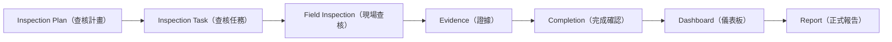
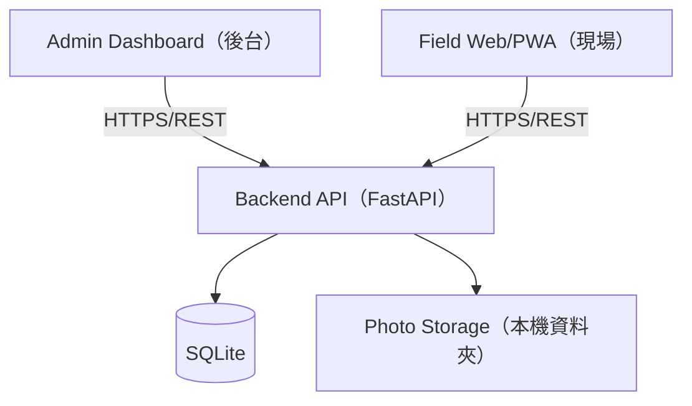
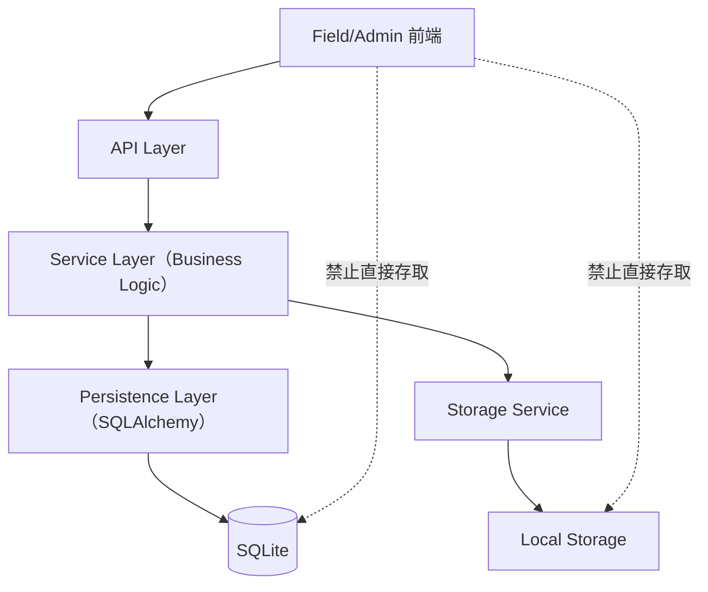
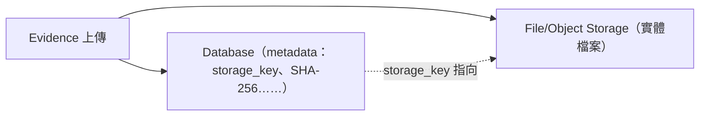
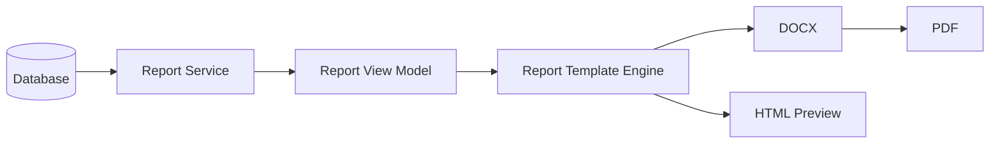
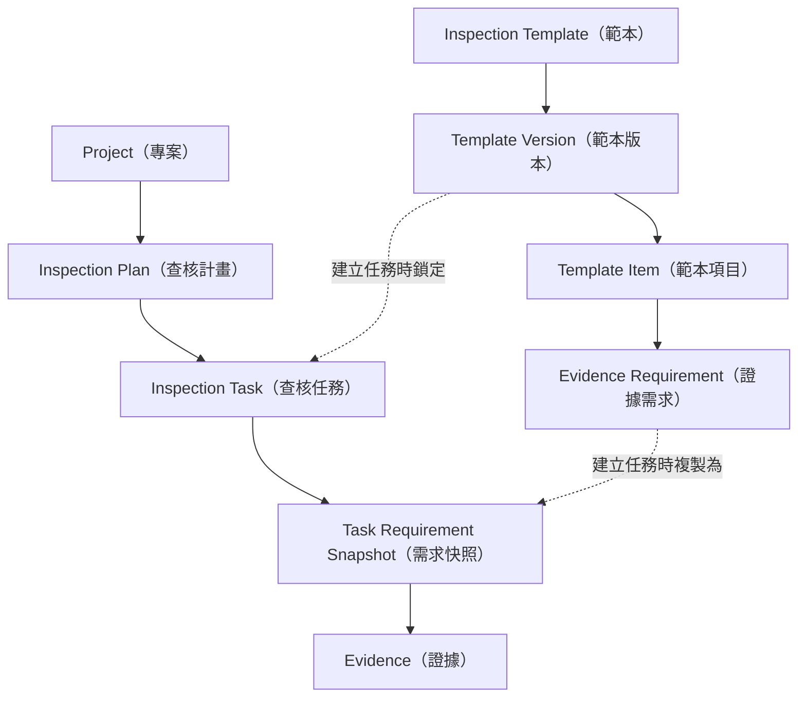
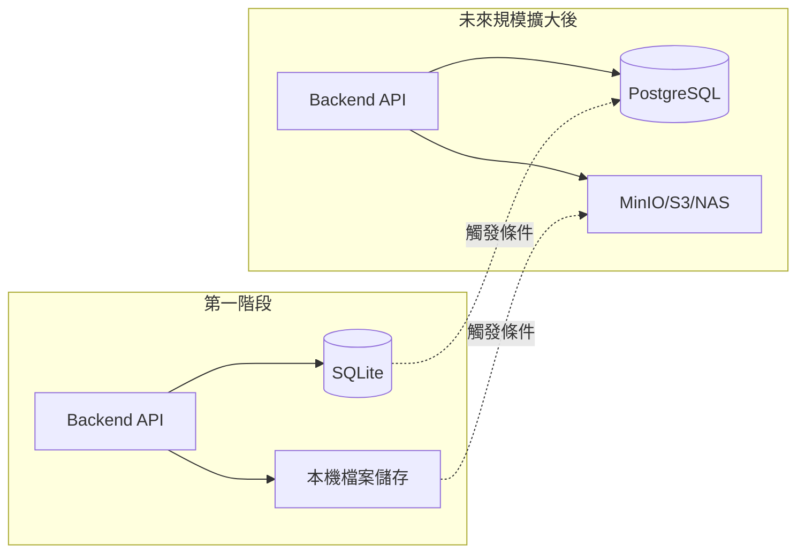
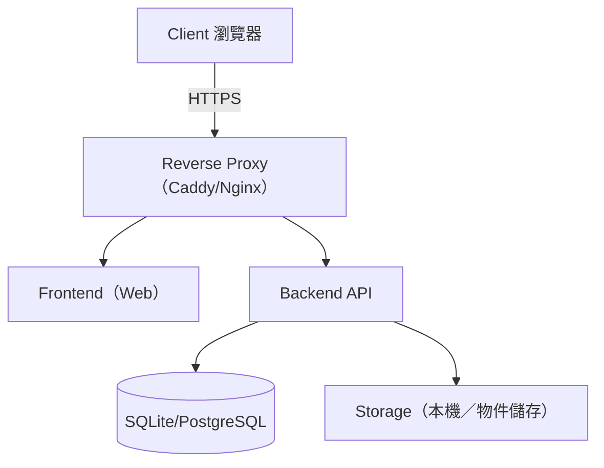

# 系統總覽（Overview）

**這份文件回答**：InspectFlow 要解決什麼問題、服務誰、第一階段做到哪裡、整體架構長什麼樣子？
**什麼時候讀**：規劃新功能前，先確認提案是否落在第一階段範圍；第一次接觸這個系統，或需要一張全局
架構圖時。

## 目的

架構基準文件描述問題的敘事前提是：若缺乏系統支援，工程現場查核容易呈現斷裂狀態——照片、檢查表與文
字說明在現場各自零散產生，事後才人工彙整成查核報告。這是來源文件對問題的敘事前提，**非**經調查驗證
的現況數據，本文件也未查證現行流程是否確實如此零散。系統要避免的是這種斷裂帶來的三個後果：查核點是
否真的蒐集到正確證據難以保證、實際完成進度難以即時掌握、最後難以產出一份可站得住腳、可重現的正式查
核報告。InspectFlow 的目的就是把這條路徑串成一個閉環：從規劃查核、現場執行與證據蒐集，到由後端驗證
的完成確認、後台儀表板彙整，最終產出正式報告（依據：架構基準 §1）。

`InspectFlow` 這個名稱由 `Inspection`（查核）與 `Flow`（流程）組合而成，代表本系統管理的是完整的工程
查核流程，而非單純的拍照工具（依據：架構基準 §0.1）。

`Dashboard` 是管理與監控介面；真正對業主、監造、政府機關與長期歸檔具有意義的正式產出，是
**DOCX／PDF 報告**，不是儀表板本身（依據：架構基準 §20.1）。閉環的終點是「可保存、可追溯、可正式交
付的 DOCX 與 PDF」，而不只是儀表板可視化（依據：架構基準 §1、§20.1、§20.22、§30 Phase 9–10）。Pilot
階段是否真正成功，還要看現場可用性、計畫排程是否貼合實務、現場網路狀況、資料量與備份是否可控、報告
產製時間是否可接受（依據：架構基準 §31）。

現場流程**必須**能在手機與平板上流暢操作，這是設計現場 UI 時的硬性前提，不是加分項
（依據：架構基準 §5.3、§13A.13、§31）。

### 核心價值

架構基準文件列出的核心價值（依據：架構基準 §1）：

1. 降低現場工程師的操作負擔。
2. 統一查核與照片蒐集格式。
3. 讓照片與查核項目建立明確關聯。
4. 讓後台可以即時掌握完成度。
5. 保存可追溯的歷史查核資料。
6. 為未來 PostgreSQL、NAS／MinIO／S3、離線模式與更完整的工程生命週期系統保留演進空間。

## 服務對象

系統內部角色（依據：架構基準 §17）與後台／現場的職責分工（依據：架構基準 §6.1–6.2）如下：

| 角色 | 職責 |
|---|---|
| 管理者 / 協調者（Admin / Coordinator） | 建立人員、專案、查核範本與範本版本，建立查核計畫、指派工程師、批次產生任務，監看完成度與異常，審閱照片並產生報告（依據：架構基準 §6.2）。 |
| 現場工程師（Inspector / Field Engineer） | 查看今日指派任務，依要求拍照、填寫必要說明，並將任務標記完成（依據：架構基準 §6.1）。 |
| 檢視者（Viewer） | 依權限矩陣唯讀存取後台儀表板（依據：架構基準 §17）。 |

系統定義的四個基準角色為 `ADMIN`、`COORDINATOR`、`INSPECTOR`、`VIEWER`（依據：架構基準 §17）；確切的
權限矩陣待決議，見 [05-open-questions.md](05-open-questions.md) [OQ-08](05-open-questions.md#oq-08)。

除了系統內部角色之外，正式報告（DOCX／PDF）另有一群**文件收受方**：業主、監造單位、品管、政府標案審
查方，以及文件歸檔／管理系統，他們不一定是系統的登入使用者，而是報告的閱讀與簽核對象
（依據：架構基準 §20.1、§20.12–20.13）。設計現場與後台流程時，需要區分「誰是系統使用者」與「誰只是
最終文件的收受者」。

## 查核生命週期

系統圍繞以下生命週期建構（依據：架構基準 §0.1、§20.1）：



依據：架構基準 §0.1、§1

- 生命週期的起點是 `Inspection Plan`，終點是正式 `Report`，不是 `Dashboard`。
- `Dashboard` 只是監控介面；`Report`（DOCX／PDF）才是對業主、監造與政府機關具有正式意義的產出。
- 每個節點對應一個系統實體，名詞定義見 [04-glossary.md](04-glossary.md)。

以閉環方式描述，對應到誰做什麼（依據：架構基準 §1）：

```text
後台建立查核工作 → 指定工程師與查核內容 → 現場工程師查看今日任務 → 依要求拍照 / 填寫說明
→ 系統確認必要證據是否完成 → 完成查核 → 後台 Dashboard 彙整 → 產生查核報表
```

## 第一階段（MVP）範圍

第一階段的目標是完成一個完整閉環，不是打造大平台（依據：架構基準 §1）。架構基準文件以開發階段順序
具體定義了這個範圍（依據：架構基準 §30）：

- **Phase 0 — Repository / Skeleton**：專案骨架、健康檢查端點。
- **Phase 1 — Database Foundation**：SQLAlchemy + Alembic + SQLite；`User`、`Project`、`Template`、
  `TemplateVersion`。
- **Phase 2 — Authentication**：登入 / 登出 / 目前使用者 / 角色。
- **Phase 3 — Template System**：`Template`、`TemplateVersion`、`TemplateItem`、`EvidenceRequirement`。
- **Phase 4 — Inspection Planning**：`InspectionPlan`、`InspectionTask`、任務需求快照，並由起訖點與
  間距自動產生任務。
- **Phase 5 — Field UI**：今日任務、任務詳情、證據檢查清單、狀態。
- **Phase 6 — Photo Upload & Field Evidence Editor**：拍照、非破壞式編輯、上傳、儲存、Evidence 紀錄。
- **Phase 7 — Task Completion Validation**：必要證據 vs. 已上傳證據的伺服器端驗證。
- **Phase 8 — Admin Dashboard**：今日工作量、完成數／完成率、工程師與專案進度。
- **Phase 9 — Formal Report Delivery**：Report View Model → DOCX 範本 → DOCX 產出 → PDF 轉換 →
  版本／核發控管。MVP **必須**同時具備 DOCX 與 PDF 輸出，並保存 Report Template Version、文件編號
  （Document Number）、版次（Revision）、產製時間與產製者、DOCX／PDF 儲存鍵、資料快照（Data
  Snapshot）與 SHA-256，且已核發的產出**不得**被覆蓋，不是只做儀表板可視化
  （依據：架構基準 §20.22、§30 Phase 9 MVP 驗收）。完整的簽核／電子簽章／核發流程（Report Phase E
  的 Approval、Issue）**得**先以空白簽名欄簡化處理，正式版面與流程留待
  [OQ-07](05-open-questions.md#oq-07) 定案（依據：架構基準 §15、§20.12、§20.21）。
- **Phase 10 — Pilot Deployment**：單一 Linux 伺服器、Docker Compose、HTTPS、持久化儲存。

一個版本要視為「可部署」，**必須**滿足 §22A.20 的完整 Deployment Definition of Done，包括 DOCX／PDF
可產出、重啟後資料不消失等條件（依據：架構基準 §22A.20）。

### MVP 的證據類型邊界

MVP **應**預設先實作 Evidence Type `PHOTO` 與 `TEXT`；來源文件僅列為「可只實作」這兩類，並非唯一合
法類型（依據：架構基準 §12.6）。資料模型雖預留了 `NUMBER`、`BOOLEAN`、`SIGNATURE`、`DOCUMENT`，是否
啟用其他類型，**須**經團隊範圍決策後才納入交付範圍，不由本文件片面認定（依據：架構基準 §12.6、
§38 Evidence/Result）。由誰、何時決定擴大證據類型範圍，見
[OQ-20](05-open-questions.md#oq-20)；若團隊已於 Pilot 前確定僅實作兩類，應在
[03-decisions-and-stack.md](03-decisions-and-stack.md) 另立決策並註明這是團隊決策而非來源硬性規定。

### 目前的運作前提（屬第一階段基準，非永久限制）

第一階段的運作前提為：Online-first、單一後端 host、SQLite + WAL、本機持久化照片／報告儲存、單一
React 專案（Admin／Field 以路由區分，惟此為建議而非拍板決策，見下）、Linux 伺服器 + Docker Compose
（依據：架構基準 §3、§5.1–5.3、§9、§22.1–22.7）。這些是第一階段的部署決策，不是永久上限；對應的演進
條件見 [03-decisions-and-stack.md](03-decisions-and-stack.md)（[KD-08](03-decisions-and-stack.md#kd-08)
SQLite、[KD-09](03-decisions-and-stack.md#kd-09) Docker Compose）；單一前端專案本身是「建議」而非拍板
決策，已改列為待決議，見 [OQ-21](05-open-questions.md#oq-21)。

## 明確排除的非目標（第一階段）

架構基準文件明確指出第一階段**不是**：

- 一套龐大的工程 ERP，也不是一次到位的完整工程生命週期管理平台（依據：架構基準 §1）。

為避免過度工程化，第一階段明確不做以下項目（依據：架構基準 §34）：

```text
Microservices                    Data Warehouse
Kubernetes                       Elasticsearch
Kafka                            Advanced BI
Redis Cluster                    多區域 HA
GraphQL                          自動 AI 圖像判定
Complex Event Sourcing           複雜 Workflow BPM
Distributed Transaction          完整 Offline Sync Engine
```

架構基準文件特別強調這是排序決定，不是對這些技術的負面評價：「不是因為這些技術不好，而是目前沒有必
要」（依據：架構基準 §34）。

## 延後但不排除的能力

架構刻意保留以下能力的擴充空間；它們是被排序延後的能力，不是被否決的能力
（依據：架構基準 §35、§1、§10、§22.7、§33）：

```text
離線模式 / 完整 Offline Sync              NCR / 缺失（Defect）追蹤
QR Code 掃描                             Re-inspection（複查）
GPS                                      Approval Workflow（簽核流程）
EXIF                                     Push Notification
數位簽章 / Electronic Approval            Audit Trail（完整事件記錄）
Voice Note（語音備註）                    WBS 整合
文件上傳                                  Drawing Linkage（圖說關聯）
影片                                      Material / Equipment Linkage
PostgreSQL（取代 SQLite）                 MinIO / S3 / NAS（取代本機儲存）
Corporate SSO
```

其中兩項是架構明確設計為「不需改變 API contract 即可演進」的結構性遷移路徑：SQLite → PostgreSQL，以
及 Local Storage → MinIO/S3（依據：架構基準 §10、§32、§33）。觸發這兩項遷移的條件見
[03-decisions-and-stack.md](03-decisions-and-stack.md)
（[KD-08](03-decisions-and-stack.md#kd-08)、[KD-02](03-decisions-and-stack.md#kd-02)）。

## 架構占位（placeholder）與業務決策的界線

哪些是「架構已經固定的骨架」、哪些是「業務資料還沒定案」，界線如下：實際的專案／人員／地點／工項欄
位、範本規則與每點所需照片數、查核結果（Result）語意、報表最終版面、簽核與編號流程，都留待未來的
Domain / Data Model 規格與 Pilot 階段拍板，本文件不代為決定（依據：架構基準 §0、§12、§38–39）。這些
未定案項目完整列於 [05-open-questions.md](05-open-questions.md)，請勿把架構基準文件裡的「範例」誤讀
為已定案欄位。

## 架構總圖

以下 7 張圖搭配上方的查核生命週期圖，構成本資料夾的完整架構視圖。來源尚未拍板的部分一律用虛線標
「待定」，並指向對應的待決議條目；圖本身不代為裁決。

### 第一版總體架構



依據：架構基準 §3

- 前端（Admin、Field）一律經 HTTPS/REST 呼叫 Backend API，不直接碰資料庫或檔案儲存（見
  [PR-01](02-principles.md#pr-01)）。
- 第一版資料庫是 SQLite、照片存本機資料夾；兩者的演進路徑見下方「儲存與資料庫演進路徑」。
- Admin 與 Field 是否維持同一個前端專案待定（見 [OQ-21](05-open-questions.md#oq-21)）。

### Backend 分層與存取邊界



依據：架構基準 §2.2、§7

- 前端只能打 API Layer；資料庫與檔案儲存一律經 Service → Persistence／Storage，不得繞過（見
  [PR-01](02-principles.md#pr-01)、[PR-02](02-principles.md#pr-02)）。
- Service Layer 是唯一放業務邏輯的地方；API Layer 不做「是否完成」這類判斷。
- 後端內部服務（例如 Report Service）走同一條 Service → Persistence／Storage 路徑，不必自我呼叫
  API（見 [PR-01](02-principles.md#pr-01)）。

### 檔案與資料庫分離



依據：架構基準 §2.3、§13.1–13.3

- 照片實體檔案永遠不進關聯式資料庫；資料庫只存 metadata 與 `storage_key`（見
  [PR-02](02-principles.md#pr-02)）。
- `storage_key` 由後端以 Evidence 的 UUID 產生，不用使用者原始檔名。
- 具體儲存鍵路徑格式尚未統一，見 [04-glossary.md](04-glossary.md) `storage_key` 條目與
  [G-02](05-open-questions.md#g-02)。

### 報表產製管線



依據：架構基準 §20.2

- 報表資料由後端重新組裝，前端不拼正式文件（見 [PR-06](02-principles.md#pr-06)）。
- DOCX 與 PDF 共用同一份 Report View Model，確保兩種格式內容一致。
- 正式環境採用哪一種 DOCX → PDF 轉換工具待定（見 [OQ-15](05-open-questions.md#oq-15)）。

### 主要實體關係



依據：架構基準 §12

- `Inspection Task` 建立時鎖定某個 `Template Version`，並把當時的 `Evidence Requirement` 複製成自
  己的 `Task Requirement Snapshot`（見 [PR-04](02-principles.md#pr-04)）。
- 完成度檢查與報告都應讀 `Task` 自己的 Snapshot，不直接查目前的 `Template Item` / `Evidence
  Requirement`。
- `Evidence` 隸屬於某個 `Task` 與其 `Task Requirement Snapshot`，可再往上追溯到 `Plan` 與
  `Project`（見 [PR-07](02-principles.md#pr-07)）。

### 儲存與資料庫演進路徑



依據：架構基準 §10、§33

- 兩條演進路徑都設計成不需改變 API contract（見 [PR-02](02-principles.md#pr-02)、
  [PR-03](02-principles.md#pr-03)）。
- SQLite → PostgreSQL 的觸發條件見
  [03-decisions-and-stack.md](03-decisions-and-stack.md)（[KD-08](03-decisions-and-stack.md#kd-08)）；
  本機儲存 → 物件儲存的觸發條件見（[KD-02](03-decisions-and-stack.md#kd-02)）。
- MVP 階段兩者都只由單一 Backend Host 存取，不透過 network filesystem 共用。

### 部署拓撲



依據：架構基準 §22.5–22.7

- 第一階段標準部署單位是 Docker Compose；SQLite 與 Storage 用 persistent volume／bind mount 掛載到
  Backend，不是獨立 container（見 [KD-09](03-decisions-and-stack.md#kd-09)）。
- 升級到 PostgreSQL 後，Compose 會多一個 db service；API 對外呼叫路徑不變。
- 部署基準見 [03-decisions-and-stack.md](03-decisions-and-stack.md)
  （[KD-09](03-decisions-and-stack.md#kd-09)）；環境細節與待決事項見
  [OQ-18](05-open-questions.md#oq-18)。

## 相關文件

- 每一張圖背後的規則與理由，見 [02-principles.md](02-principles.md)；決策與技術棧見
  [03-decisions-and-stack.md](03-decisions-and-stack.md)。
- 名詞定義見 [04-glossary.md](04-glossary.md)。
- 遇到看似未定案或前後矛盾之處，先查 [05-open-questions.md](05-open-questions.md)，不要把自己的假設
  當成定案。
