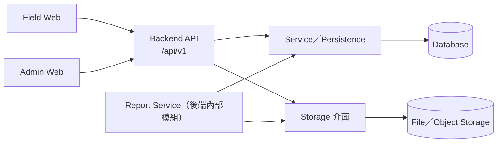
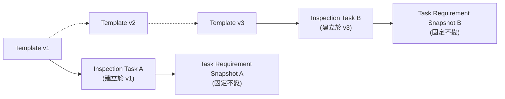
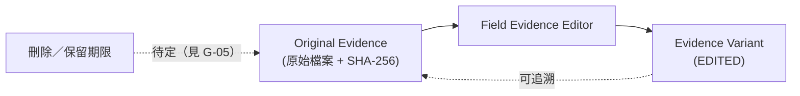
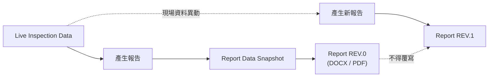
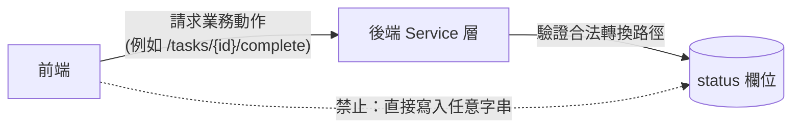

# 設計原則（Design Principles）

**這份文件回答**：InspectFlow 有哪些必須／應／得遵守的設計原則，違反時代表什麼風險。
**什麼時候讀**：新增或修改功能前，先對照這裡的原則檢查有沒有違反。每條原則附一個可驗證的「怎麼檢查」。

條目依「對實作者的重要性」排序，不是依來源文件的章節順序；同一個論點在來源文件多處重複出現時，這裡合併成一條原則並列出所有出處。決策記錄見 [03-decisions-and-stack.md](03-decisions-and-stack.md)；名詞定義見 [04-glossary.md](04-glossary.md)。

## PR-01：前端只能透過後端 API 存取資料，業務規則一律由後端覆核

**狀態**：已決定

**規則**：所有**外部用戶端**（Field Web、Admin Web，含由 UI 觸發報告產製的操作）**必須**透過 Backend API 存取與寫入資料，**不得**直接讀寫資料庫或檔案儲存。前端渲染的是後端回傳的資料；一個任務是否真的可以完成，**必須**由後端重新驗證一次，不能只靠前端判斷。**後端內部服務**（例如 Report Service）**得** 直接透過 Service／Persistence／Storage 介面存取自己的資料，不必、也不要求對自身發出 HTTP API 呼叫 （依據：架構基準 §2.2、§2.4、§7.1–7.2、§14、§16.4–16.6、§20.2）。

依據：架構基準 §2.2、§20.2

- 前端（Field Web／Admin Web）一律走 `Backend API`，不能直接連資料庫或儲存。
- `Report Service` 是後端內部模組，直接用內部介面存取自己的資料，不必繞回 `/api/v1`。

**為什麼**：集中權限控管、資料驗證與商業邏輯；讓 SQLite 換成 PostgreSQL 時前端不必重寫；讓未來的 App、PWA、第三方介面可以共用同一套 API；也讓 `/api/v1` 這個 contract 在資料庫／儲存體遷移過程中維持穩定（依據：架構基準 §2.2）。正式報告的資料流是「Database → Report Service → Report View Model → Template Engine → DOCX／PDF」，Report Service 屬於後端內部模組，不是外部前端（依據：架構基準 §20.2）。

**怎麼做**：
- 任何從 UI 出發的讀寫都經過一個有版本號的後端端點。
- 前端不內嵌資料庫連線、儲存體 SDK 或檔案系統路徑。
- 「是否可以完成」這類判斷永遠在後端重跑一次，前端判斷只是 UX 提示。
- 後端服務之間（例如 Report Service 讀取 Database／Storage）得直接呼叫內部介面。

**不要做**：
- ✗ 前端元件直接開啟 SQLite／PostgreSQL 連線。
- ✗ 前端自行組出儲存路徑讀取照片檔案，而不是呼叫後端端點。
- ✗ 前端僅依自己的檢查結果把任務標記完成，不經後端 `/tasks/{id}/complete` 覆核。
- ✗ Report Service 為了取得自己資料庫裡的資料，繞一圈自我呼叫 HTTP API，而非直接使用內部介面。

**怎麼檢查**：搜尋前端程式碼庫，確認沒有資料庫連線字串、ORM／Storage SDK 的 import；或針對一個「只靠前端判斷即完成」的任務直接發出後端請求，確認後端仍會重新驗證一次（可寫成整合測試）。

**依據**：架構基準 §2.2、§2.4、§7.1–7.2、§14、§16.4–16.6、§20.2

## PR-02：檔案與關聯式資料分離，儲存鍵由後端產生

**狀態**：已決定

**規則**：照片等證據檔案**禁止**以 BLOB 形式塞進關聯式資料庫；資料庫只保存 metadata（`evidence_id`、 `task_id`、`requirement_id`、`storage_key`、檔名、MIME type、檔案大小、SHA-256、`captured_at`、 `uploaded_at`），實際檔案內容存放於檔案／物件儲存（依據：架構基準 §2.3）。儲存鍵（storage key）
**必須**由後端以 Evidence 的 UUID 產生，**不得**使用使用者原始檔名作為唯一識別；原始檔名只作為附帶 metadata 保存（依據：架構基準 §13.2）。

**為什麼**：避免資料庫因大量照片而膨脹；讓未來從本機儲存搬到 MinIO/S3/NAS 時不需要重新設計；避免使用者原始檔名衝突或攜帶不可信資訊（依據：架構基準 §2.3、§13.2）。

**怎麼做**：
- 所有檔案存取一律經過 `Storage` 抽象介面（`save`/`open`/`delete`），業務邏輯不依賴特定儲存體實作 （依據：架構基準 §7.4、§33）。
- 新增欄位要存放大型二進位內容前，先確認是否該走 Storage 而不是資料庫欄位。

**不要做**：
- ✗ 在資料庫新增一個欄位直接存放圖片位元組。
- ✗ 服務層直接呼叫 `open("/storage/photos/...")` 而不經過儲存抽象層。
- ✗ 以 `IMG_1234.jpg` 這類使用者原始檔名作為 storage key 的唯一識別。

**怎麼檢查**：查詢資料庫 schema，確認 Evidence 相關資料表沒有 BLOB／二進位型別欄位；上傳一張照片後， 檢查資料庫只多出一筆 metadata，實際檔案位於 Storage、`storage_key` 是 UUID 而非原始檔名（可寫成整合測試）。

**依據**：架構基準 §2.3、§7.4、§13.2、§33

## PR-03：資料庫存取與結構演進必須透過抽象層

**狀態**：已決定

**規則**：資料庫存取**必須**透過 SQLAlchemy，結構演進**必須**透過 Alembic migration；正式環境**禁止**依賴 `Base.metadata.create_all()` 管理 Schema，也**禁止**在正式資料庫上手動 `ALTER` 而不留下對應 migration；**應**避免大量 SQLite-specific 的 raw SQL，如需使用，必須標註其資料庫相依性（依據：架構基準 §4.4–4.5、§7.3、§22A.9、§22A.12）。

**為什麼**：這一層是 SQLite 未來能平滑轉換到 PostgreSQL 的關鍵；CI 定期以 PostgreSQL 執行 migration 與整合測試，可以避免一年後才發現大量程式碼依賴 SQLite-only 行為（依據：架構基準 §4.4、§27.3、 §32）。

**怎麼做**（從第一天開始遵守，依據：架構基準 §32）：
- SQL 一律透過 SQLAlchemy；Schema 一律透過 Alembic。
- 不依賴 SQLite AUTOINCREMENT 作為跨系統 identity。
- 照片不進資料庫；避免 SQLite-specific raw SQL。
- CI 定期跑 PostgreSQL 整合測試；timestamp／boolean／JSON 等型別要考慮跨資料庫行為一致性。
- 資料庫存取不出現在前端。

**不要做**：
- ✗ 新功能直接寫一段只有 SQLite 支援語法的 raw SQL，且未標註資料庫相依性。
- ✗ 用 `Base.metadata.create_all()` 在正式環境建立新資料表，而不是產生一份 Alembic migration。

**怎麼檢查**：CI 對 PostgreSQL 執行 Alembic migration 與整合測試需全部通過；grep 原始碼確認正式環境路徑沒有 `Base.metadata.create_all()`（可寫成 CI 檢查步驟）。

**依據**：架構基準 §4.4–4.5、§7.3、§22A.9、§22A.12、§27.3、§32

## PR-04：任務建立後，需求內容就固定下來

**狀態**：已決定

**規則**：`Inspection Template` **必須**版本化（v1、v2、v3……）；建立 `Inspection Task` 時，**必須**把當下的需求複製成 `Task Requirement Snapshot`。之後範本怎麼改，都不影響已建立的任務 （依據：架構基準 §2.5、§12.9）。

依據：架構基準 §2.5、§12.9

- 範本從 v1 演進到 v3，不會改變已建立任務的快照。
- 每個 Task 只讀自己的 Snapshot，不 join 目前版本的範本。

**為什麼**：工程稽查系統的歷史追溯性非常重要：必須永遠能回答「這個任務當初實際要求證明什麼」，且答案不受後續範本編輯影響（依據：架構基準 §2.5）。

**怎麼做**：
- 完成度檢查、報表產製，一律讀任務自己的 snapshot。

**不要做**：
- ✗ 完成度檢查直接 join 目前的 `template_items`。

**怎麼檢查**：修改範本後，舊任務的完成度與報表內容不變（可寫成測試）。

**依據**：架構基準 §2.5、§12.9

## PR-05：證據影像採非破壞式編輯，原圖不得就地覆寫

**狀態**：已決定

**規則**：現場工程師**得**對照片做有限度的調整（縮放檢視、裁切、旋轉、亮度，對比為可選項），但**不得**覆蓋原始照片；每次編輯**必須**產生新的 `Evidence Variant`（`EDITED`），並保留原圖、其 SHA-256， 以及產生該 Variant 所用的編輯參數（依據：架構基準 §13A.2、§13A.4）。物件移除／新增、Generative Fill、AI Retouch、內容替換等會改變證據實質內容的操作，**禁止**作為標準功能提供（依據：架構基準 §13A.6）。

依據：架構基準 §13A.2、§13A.4

- 原圖不能就地覆寫；刪除與保留期限尚未定案。
- Variant 可以回溯到原圖；刪除與保留期限規則還沒定案（見 G-05）。

**為什麼**：查核照片具有證據性質：業主或監造可能要求確認原始影像；裁切可能移除周邊現場資訊；亮度調整可能改變視覺判讀；若未來導入稽核或電子簽章，原始檔案的完整性至關重要（依據：架構基準 §13A.3、§37 ADR-010）。

**怎麼做**：
- 任何「照片美化」類功能都是新增（產生新 Variant），且僅限提升可讀性／版面表現的操作。
- 刪除、保留期限與軟刪除政策目前不在本原則規範範圍內，待 [G-05](05-open-questions.md#g-05) 定案後再補上具體規則；本原則不預先禁止刪除。

**不要做**：
- ✗ 編輯流程把調整後的像素直接寫回原始檔案。
- ✗ 新增一個以 AI 生成內容改變照片實質內容的「編輯」功能，作為標準功能項目。

**怎麼檢查**：編輯照片後，比對原圖位元組與 SHA-256，確認兩者不變且新增 `EDITED` Variant。原圖是否另有 `ORIGINAL` Variant 記錄，見 [G-02](05-open-questions.md#g-02)。

**依據**：架構基準 §13A.2–13A.4、§13A.6、§13A.3、§37 ADR-010

## PR-06：正式報告是版本化、不可覆蓋的快照實體

**狀態**：已決定

**規則**：一份產生的 Report **必須**是一個持久化實體（`reports`），擁有自己的 id、文件編號、版次、DOCX／PDF 儲存鍵，以及產生當下所用資料的**快照（Data Snapshot）**；`status` 欄位依 §20.6 **應**保留——不是用完即丟的暫存檔（依據：架構基準 §20.6、§20.7）。若之後現場資料被修改或補件，**不得**讓已核發的版次（例如 `REV.0`）悄悄改變；**應**改為產生新版次（`REV.1`），而不是覆蓋舊版次（依據：架構基準 §20.7）。

依據：架構基準 §20.6、§20.7

- 每次產生報告都固定一份資料快照，不是直接指向即時資料。
- 現場資料異動後，已核發的 REV.0 不變，改用新版次 REV.1 承接。

**為什麼**：對業主／政府標案交付物而言，已核發的版次必須維持核發當下的樣貌，即使之後現場資料被更正或補充（依據：架構基準 §20.7）。Dashboard 只是監控介面，DOCX／PDF 才是真正的正式、可歸檔交付物，因此報告產製屬於核心產品能力，不是可有可無的附屬功能（依據：架構基準 §20.1、§20.22、§37 ADR-009）。

**怎麼做**：
- 報告產製一律讀取（或產生）一份不可變的資料快照來渲染。

**不要做**：
- ✗ 「重新整理報告」功能就地重新渲染並覆蓋一個已核發版次的 DOCX／PDF，而不是產生新版次。

**怎麼檢查**：對已 `ISSUED` 的 Report 呼叫「重新產生」操作，驗證系統建立一筆新版次（`REV.1`）而不是覆蓋原本的 DOCX／PDF 檔案與資料列（可寫成整合測試比對前後版次筆數與檔案雜湊）。

**依據**：架構基準 §20.1、§20.6、§20.7、§20.22、§37 ADR-009

## PR-07：端到端可追溯性

**狀態**：已決定

**規則**：報告中使用的照片及其影像衍生物**必須**回溯至原始證據；有衍生版時，沿 Report Photo → Variant → Original Evidence 追查（依據：架構基準 §20.11、§13A.9）。**一般 Evidence**（不限於照片，含 TEXT 等其他類型）**必須**可以沿著 Evidence → Task Requirement Snapshot → Task → Inspection Plan → Project 回溯（依據：架構基準 §12.9–12.10、§20.11）。在 [G-02](05-open-questions.md#g-02)（Original 的唯一來源）定案前，本原則**不**要求 `ORIGINAL` 必須額外對應一筆 `Evidence Variant` 資料列；原圖究竟是 `Evidence.storage_key` 本身、還是一筆 `variant_type = ORIGINAL` 的 Variant 記錄，留待 [G-02](05-open-questions.md#g-02) 裁決。

**為什麼**：對業主／監造／政府稽核而言，必須隨時能回答「報告裡這張照片到底來自哪一筆原始查核紀錄」； 同時任一筆一般 Evidence 也必須能回答自己隸屬於哪個任務、計畫與專案（依據：架構基準 §20.11）。

**怎麼做**：
- 報告照片與其衍生圖不設計出一條會遺失回溯連結的資料路徑；即使是縮圖或為報告最佳化過的圖片，也保留回 到來源證據的參照。
- 一般 Evidence 的可追溯性以其對 Task Requirement Snapshot／Task／Plan／Project 的外鍵關聯為準，**不** 強制要求每一筆 Evidence 都走 Variant 鏈——TEXT 等非影像類型的 Evidence 沒有 Variant 鏈可走 （依據：架構基準 §12.10）。

**不要做**：
- ✗ 產生一個報告用圖片素材，卻沒有任何欄位記錄它是從哪一筆 `Evidence` / `Task` / `Inspection Plan` / `Project` 衍生出來的。
- ✗ 一筆一般 Evidence（例如 TEXT）無法追溯回其所屬 Task 與 Plan。

**怎麼檢查**：抽查報告照片，從照片本身或衍生版的外鍵查到來源 Evidence；抽查一筆一般 Evidence，沿 Task Requirement Snapshot → Task → Plan → Project 外鍵可查到所屬專案（可寫成查詢腳本）。

**依據**：架構基準 §12.9–12.10、§13A.9、§20.11

## PR-08：最低限度的建立與修改紀錄

**狀態**：已決定

**規則**：重要資料**必須**保留建立與最後修改的時間和操作者身分，**應**從早期使用 `created_at`、`created_by`、`updated_at`、`updated_by`（依據：架構基準 §19）。證據編輯**必須**記錄原圖與編輯版、操作參數、建立者、時間及雜湊（依據：架構基準 §13A.10）。完整操作歷史仍需額外的 audit log；這四欄只能記錄建立與最後修改。

**為什麼**：事後無法可靠回填建立者和時間；最後修改欄位也不能重建每次更動（依據：架構基準 §19）。

**怎麼做**：
- 新增任何可變、面向使用者的紀錄（Evidence Variant、Report、Plan、Task）時，記得填建立時間與建立者 （可變更的記錄還需要最後修改的時間與操作者）。

**不要做**：
- ✗ 新增一張 Evidence Variant 或一筆 Report 紀錄卻沒有建立時間與建立者。
- ✗ 宣稱只靠 `updated_at` / `updated_by` 就能重建一筆資料完整的歷次修改歷史。

**怎麼檢查**：抽查 Evidence Variant、Report、Plan、Task，確認建立時間與建立者有值；修改後可查到最後修改的時間與人員。

**依據**：架構基準 §13A.10、§19

## PR-09：查核規則以資料表示，而非寫死邏輯

**狀態**：已決定

**規則**：查核規則（要拍哪些照片、要填哪些欄位等）**必須**以 `Template` / `Requirement` 資料表示，
**不得**在前端或後端寫成針對特定項目的 `if/else` 判斷式（依據：架構基準 §2.4）。查核間距 （interval）等欄位目前歸屬 `Template` 還是 `Inspection Plan` 輸入層尚未定案，本原則**不**代為裁決其資料表歸屬，見 [G-01](05-open-questions.md#g-01)。

**為什麼**：當規則改變（例如電纜橋架查核從「長寬高三張照片」改成「總覽照、高度照、接頭照 × 2」）時， 前端只需依後端回傳的需求資料重新渲染畫面，不需要改版或重新部署（依據：架構基準 §2.4）。

**怎麼做**：
- 新的查核規則以 `EvidenceRequirement` / `TemplateItem` 紀錄的形式撰寫，而不是新增程式分支；前端是任 何需求資料的通用渲染器。
- interval 欄位歸屬定案前，不預先把它固定寫死在某一張表的 schema 假設裡。

**不要做**：
- ✗ 在前端或後端加入類似 `if item == "cable_tray": require_length_photo()` 的程式碼分支，而不是在範 本版本裡新增一筆需求紀錄。

**怎麼檢查**：新增或修改一條查核規則時，只新增／修改 `Template`／`Requirement` 資料列，前端不需要改版部署即可正確渲染（可寫成驗收測試）。

**依據**：架構基準 §2.4

## PR-10：現場 UI 力求精簡，並適配手機與平板

**狀態**：已決定

**規則**：Field UI **不得**讓現場工程師看到 Template Version、Database ID、Requirement Schema、 Project Configuration、Storage Key、metadata 或資料庫管理功能；現場工程師的心智模型只有「今天要做什麼 → 現在拍什麼 → 還缺什麼 → 是否完成」（依據：架構基準 §6.1）。系統複雜度**應**留在 Admin UI／後端 （依據：架構基準 §6.2）。現場流程**應**能在手機、平板上流暢操作（依據：架構基準 §5.3、§13A.13、 §31）。

**為什麼**：現場操作速度與低認知負擔的優先度高於功能豐富度；後台才是允許系統複雜度存在的地方（依據：架構基準 §6.1–6.2）。

**怎麼做**：
- 在 Field UI 新增任何控制項、畫面或術語之前，先確認它是否該放在 Admin UI。
- Field UI 的新增項目由現場工作流程需求驅動，而不是後端實作方便。

**不要做**：
- ✗ 在現場工程師的任務畫面上出現範本版本選單、原始需求 Schema 編輯器，或資料庫 UUID／Storage Key。

**怎麼檢查**：對 Field UI 做畫面 review，確認不出現 Template Version、資料庫 ID、Storage Key 等技術性欄位；在手機／平板尺寸的裝置或模擬器上實際操作一次現場流程，確認可順利完成。

**依據**：架構基準 §5.3、§6.1–6.2、§13A.13、§31

## PR-11：MVP 採模組化單體，避免過早導入分散式架構

**狀態**：已決定

**規則**：第一版**不得**在缺乏具體需求的情況下導入 Microservices、Kubernetes、Kafka、Redis Cluster、API Gateway、Event Bus、CQRS、分散式資料庫或複雜 Workflow Engine；第一版**必須**採用
**Modular Monolith**：內部模組邊界清楚，但部署時仍是單一 Backend Application（依據：架構基準 §2.1）。

**為什麼**：同時取得快速開發、容易 debug、容易部署、容易備份、容易理解，並保留未來仍可拆分的可能性 （依據：架構基準 §2.1）。只有在真正出現大量 backend replica、多節點協調、高可用性、自動 failover 或大型分散式負載時，才需要評估 Kubernetes／Nomad 等企業容器平台，**不得**因為「未來可能變大」就在第一天導入（依據：架構基準 §22A.19）。

**怎麼做**：
- 在後端內部維持乾淨的模組邊界（API 層 / Service 層 / Persistence / Storage，依 §7），為未來拆分留 餘地。

**不要做**：
- ✗ 在兩個後端模組之間加入訊息佇列來解決一個模組化邊界就能解決的問題。
- ✗ 把後端拆成兩個獨立部署的服務，只為了解決一個第一階段規模就能處理的問題。

**怎麼檢查**：檢查部署清單（例如 `docker-compose.yml`），正式服務只有一個 Backend Application 容器， 不含 Kafka、Redis Cluster、API Gateway 等元件；code review 時確認新模組以套件／模組邊界劃分，而非獨立部署服務。

**依據**：架構基準 §2.1、§22A.19

## PR-12：備份與還原涵蓋資料庫、照片與報表

**狀態**：暫定（整合備份範圍待團隊確認，見 [G-10](05-open-questions.md#g-10)）。

**規則**：Database、Photos、Reports **必須**持久化（§22.12）；資料庫與照片**必須**採可互相對應的備份策略（§23）；正式 release 前**應**備妥 Storage Backup Strategy（§22A.10）。本文件暫定將範本檔案、原圖、衍生照片、已核發 DOCX／PDF 與資料庫納入同一組可一致還原的備份。具體一致性邊界待 [G-10](05-open-questions.md#g-10) 裁定。

**為什麼**：只還原資料庫或照片，可能產生資料列與檔案互相對不上的結果（§23）。

**怎麼做**：備份與還原程序列出資料庫、範本、照片及已核發文件；新增持久化產物時更新程序。

**不要做**：只備份 SQLite 檔案，卻沒有對應照片；或只備份照片，卻缺少資料庫。

**怎麼檢查**：還原演練後，逐一查驗資料庫 `storage_key` 指向的照片與報告檔案存在且內容相符。

**依據**：架構基準 §20.5、§20.15、§22.12、§22A.10、§23；來源未明定完整聯合範圍，見 [G-10](05-open-questions.md#g-10)。

## PR-13：正式環境變更使用版本控管與可重現流程

**狀態**：暫定（§22.15 與 §22.16 的啟動順序衝突，見 [G-09](05-open-questions.md#g-09)）。

**規則**：正式環境**不得**直接改程式碼、安裝未納入版本的套件或手動改 Schema；變更**必須**經 Git → Review → Build → Versioned Image → Deploy（§22A.12）。本文件暫以 §22.15 為部署順序：備份 → Alembic migration → 啟動新版 API → 健康檢查 → Smoke Test；**必須**等 migration 完成才讓新版 API 接受請求。升級時，還**必須**隔離舊版寫入，或採用已驗證的向前相容遷移策略；失敗時依備份與回滾程序處理（§22A.9–10）。交付版本**必須**符合 Deployment Definition of Done（§22A.20）。

**為什麼**：§22.16 的 `up -d` → migration 範例可能讓尚未遷移的 API 先接收流量；即使是初次部署，也不能假定啟動後沒有請求或啟動相依問題。

**怎麼做**：`DEPLOYMENT.md` 記錄備份、遷移、服務開放流量、健康檢查與回滾閘點；團隊在 [G-09](05-open-questions.md#g-09) 裁定初次與升級部署是否需要不同腳本。

**不要做**：在 migration 完成前讓新版 API 接受請求；未隔離舊版寫入就執行不相容遷移。

**怎麼檢查**：部署演練中記錄各步驟時間與服務接流量的時點，確認備份先於 migration，migration 先於新版 API 接流量。

**依據**：架構基準 §22.15–22.16、§22A.7、§22A.9–10、§22A.12、§22A.20。

## PR-14：正式環境安全與維運底線

**狀態**：已決定

**規則**：正式環境**必須**透過 HTTPS 提供服務（依據：架構基準 §22.10）。`.env` 與其他機密設定**不得**提交到 Git Repository，Repository 只保存 `.env.example`（依據：架構基準 §22.9）。Log **不得**記錄密碼、Session secret、Authorization token（依據：架構基準 §24）。一個版本要視為可正式交付，**必須**滿足完整的 Deployment Definition of Done，其中包含備份可執行、回滾路徑存在等可驗證項目（依據：架構基準 §22A.20）。資料庫連線埠**不應**對外公開，除非有明確維運需求並搭配 firewall 控制（依據：架構基準 §22.11）。Health check 端點**不應**回傳 secret 或敏感設定（依據：架構基準 §22.14）。

**為什麼**：這些是來源文件已明言的安全與維運底線；若只靠 §22A.20 對外部各節的指向，而不把個別條目寫清楚，容易在實作時遺漏其中一項（依據：架構基準 §22.9–22.14、§22A.20、§23–24）。

**怎麼做**：
- 新增任何對外服務、健康檢查端點或 log 輸出前，先確認是否可能洩漏密碼、token 或其他敏感設定。
- 資料庫或內部服務連接埠預設不對外公開；部署文件包含可驗證的備份與還原步驟，而不是只假設「有跑備份 指令就夠了」。

**不要做**：
- ✗ 把 `.env` 或內含 `SECRET_KEY` 的設定檔提交進 Git。
- ✗ health check 端點回傳資料庫連線字串或 `SECRET_KEY`。
- ✗ log 裡直接印出使用者密碼或 Authorization header。
- ✗ 資料庫埠對外綁定 `0.0.0.0:5432` 卻沒有明確維運需求與 firewall 控制。

**怎麼檢查**：`git ls-files | grep '\.env$'` 應為空，只有 `.env.example` 存在；抽查 log 輸出與 health check 回應內容，確認不含密碼、token 或 `SECRET_KEY` 等字串。

**依據**：架構基準 §22.9–22.14、§22A.20、§23–24

## PR-15：報告產製失敗不得誤標為已完成，並可安全重試

**狀態**：已決定

**規則**：報告產製（DB read → Image processing → DOCX generation → PDF conversion → File storage → DB write）任一步驟失敗時，**不得**讓 Report 的狀態被誤標為已完成（如 `GENERATED`）；**應**採用 `DRAFT` → `GENERATING` → `GENERATED` 的中間狀態，失敗時進入 `GENERATION_FAILED` 並保留 `error_message`，以便安全重新產生（依據：架構基準 §20.17）。牽涉檔案與資料庫兩種資源的操作若中途失敗（例如 DOCX/PDF 已寫入 Storage 但資料庫交易失敗，或相反情況），**應**有明確的復原原則，避免留下「檔案存在但資料庫不知道」或「資料庫記錄存在但檔案遺失」的不一致狀態（依據：架構基準 §20.17）。

**為什麼**：報告是核心交付物，若失敗卻被誤標為已完成，使用者可能拿到不存在或損毀的 DOCX／PDF 而不自知；跨資源操作沒有明確復原原則，會讓失敗後的狀態難以排查與重試（依據：架構基準 §20.17）。

**怎麼做**：
- 新增任何涉及檔案與資料庫兩種資源的寫入流程時，先設計失敗路徑與復原／重試機制，不只實作成功路徑。
- 報告狀態機表達「產製中」與「產製失敗」，不能只有「未產生」與「已產生」兩種狀態。

**不要做**：
- ✗ 報告產製流程只在全部步驟成功後才寫一次 DB record，PDF 轉換失敗時整個沉默失敗，沒有留下任何可追 蹤的失敗狀態與錯誤訊息。

**怎麼檢查**：模擬報告產製流程在 PDF 轉換步驟失敗，驗證 Report 狀態變成 `GENERATION_FAILED` 並保留 `error_message`，而不是變成 `GENERATED`（可寫成整合測試注入轉換失敗並斷言最終狀態）。

**依據**：架構基準 §20.17

## PR-16：實體狀態轉換一律由後端 Service 層掌控

**狀態**：已決定

**規則**：有狀態的 `Inspection Plan`、`Inspection Task` 與 `Report`，**必須**由後端 Service 層控制狀態轉換；前端**不得**直接寫入任意狀態字串。其他實體若新增狀態，也沿用同一邊界（依據：架構基準 §18、§20.17）。

依據：架構基準 §18

- 前端只能請求「轉換到某狀態」的業務動作，不能直接改 `status` 欄位。
- 合法轉換路徑由後端 Service 層驗證，非法轉換一律拒絕。

**為什麼**：避免 status 被任意字串亂改而破壞狀態機的合法轉換路徑，也讓「是否可以完成」這類判斷維持與 [PR-01](#pr-01) 一致的伺服器端覆核原則（依據：架構基準 §18）。

**怎麼做**：
- 新增狀態欄位或狀態轉換邏輯時，一律在後端 Service 層定義合法的轉換規則；前端只能請求「轉換到某狀 態」的動作（例如呼叫代表明確業務動作的端點）。

**不要做**：
- ✗ 前端呼叫一個通用的 PATCH 端點，直接把 `status` 欄位設成任意字串，而不是呼叫 `/tasks/{id}/complete` 這類代表明確業務動作的端點。

**怎麼檢查**：嘗試從前端直接呼叫一個把 `status` 欄位設成任意字串的通用 PATCH 端點，應被後端拒絕；只有呼叫代表明確業務動作的端點才能改變狀態（可寫成 API 測試驗證非法轉換被拒絕）。

**依據**：架構基準 §18

## PR-17：API 契約：REST/JSON、檔案上傳與錯誤碼邊界

**狀態**：已決定

**規則**：Backend API **必須**採 REST + JSON，並以 `/api/v1` 作為前綴；照片等檔案上傳**必須**採 `multipart/form-data`（依據：架構基準 §14）。API 錯誤**應**用結構化的 `error.code` 表達（依據：架構基準 §25）。

**為什麼**：一開始就加 `/v1` 前綴成本很低，但對未來 API 演進很有價值；統一契約才能讓多個前端與未來第三方介面穩定整合（依據：架構基準 §14）。

**怎麼做**：
- 新增端點時遵守 `/api/v1` 前綴與 REST/JSON 慣例。
- 檔案上傳一律走 `multipart/form-data`，不用 JSON base64 欄位取代大型檔案上傳。
- 新增錯誤情境時，先定義對應的 `error.code`。

**不要做**：
- ✗ 新增一個不帶版本前綴的端點。
- ✗ 用 JSON base64 欄位取代 multipart 上傳大型照片檔案。

**怎麼檢查**：檢查所有 API 路徑均以 `/api/v1` 為前綴；上傳照片的請求 Content-Type 為 `multipart/form-data`；模擬一次 API 錯誤情境，回應內容含結構化 `error.code` 欄位（可寫成契約測試）。

**依據**：架構基準 §14、§25

## PR-18：修改性操作執行前先顯示影響範圍，經操作者確認才執行

**狀態**：已決定

**規則**：任何修改性操作（尤其是人員、公司、角色與權限的變更）**必須**在真正執行前，先評估並顯示這次修改的影響範圍（例如會影響多少人、多少筆資料），再由操作者確認後才執行。

**為什麼**：人員、角色、權限這類設定一改就會立即套用到所有相關對象（例如修改角色內容會立刻影響所有擁有該角色的人，見 [KD-26](03-decisions-and-stack.md#kd-26)），操作者需要在執行前先看到波及範圍，才能判斷是否真的要做這個變更。

**怎麼做**：
- 新增修改性端點或畫面時，先計算並回傳這次操作會影響的對象數量或清單（例如「這個角色目前有 12 人使用」），交由前端呈現給操作者確認。
- 沒有「確認」這一步的操作，不能視為已滿足本原則；確認前不得先行寫入。

**不要做**：
- ✗ 修改性操作只彈出通用的「確定要送出嗎？」提示，而不顯示具體影響範圍（人數、筆數）。
- ✗ 操作者還沒確認，後端就已經完成寫入。

**怎麼檢查**：對一個會影響既有人員或資料的修改性操作（例如刪除角色、修改角色內容），確認執行前畫面有顯示受影響的人數或筆數，且必須等操作者確認才會真正送出（可寫成前端／契約測試）。

**依據**：負責人決定（#63，2026-09-26）；架構基準無對應章節

## 不可延後的意圖

以下資料與邊界從第一版就要保存；遺失的歷史無法事後重建：

1. **任務需求快照**：[PR-04](#pr-04) 在任務建立時複製生效需求並保留範本版本，避免日後修改範本時改寫舊任務（§2.5、§12.4–12.9、§16.2、§37 ADR-006）。
2. **報告來源快照**：[PR-06](#pr-06) 保存範本版本、證據／Variant ID、文件編號與版次、產製者與時間、檔案鍵、雜湊及資料快照；已核發檔案不得覆蓋（§20.5–20.8、§20.11、§20.13–20.15、§30 Phase 9）。
3. **原圖與衍生關聯**：[PR-05](#pr-05) 保存原圖位元組與雜湊，以及衍生版的操作參數、建立者、時間與來源關聯（§13.3、§13A.2–13A.4、§13A.9–13A.11）。
4. **穩定 ID 與儲存鍵**：[PR-02](#pr-02)、[KD-07](03-decisions-and-stack.md#kd-07) 使用核心實體 UUID，分離業務編號；由後端產生儲存鍵，不以原始檔名當識別碼（§11、§13.1–13.2、§37 ADR-007）。
5. **資料庫與儲存抽象層**：[PR-02](#pr-02)、[PR-03](#pr-03) 集中資料庫與檔案存取，不讓 API 依賴 SQLite 或本機路徑（§2.2–2.3、§4.4–4.5、§7.4、§32–33）。
6. **身分、授權與紀錄**：[PR-01](#pr-01)、[PR-08](#pr-08) 從首筆寫入記錄操作者與時間，由伺服器檢查指派與權限（§7.1–7.2、§16.3–16.6、§17–19、§24）。
7. **可一致還原的資料集**：[PR-12](#pr-12) 確保資料庫與照片可對應；完整備份範圍待 [G-10](05-open-questions.md#g-10) 確認（§22.12、§22A.9–10、§23）。
8. **凍結 API 前釐清規則語意**：[PR-09](#pr-09) 先定義 `required`、`min_count`、`max_count`、interval 與負面結果如何影響任務完成；Result 仍待 [OQ-06](05-open-questions.md#oq-06) 決定，既有任務不得追溯改寫（§2.4、§12.6/12.9、§16.4–16.6、§25）。
