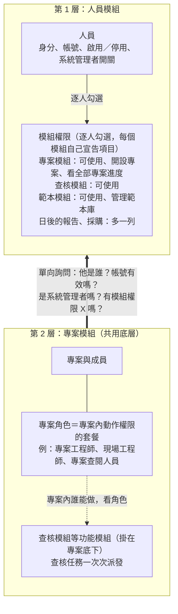
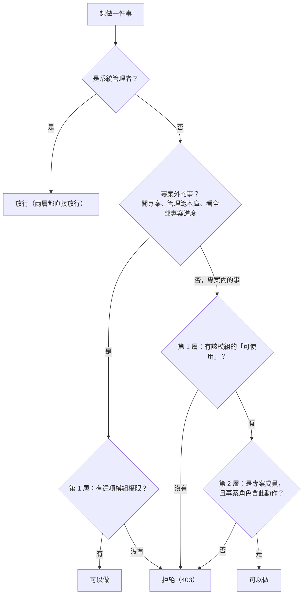
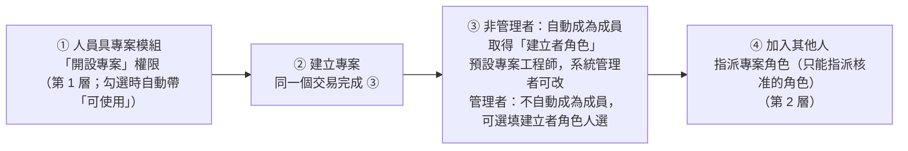
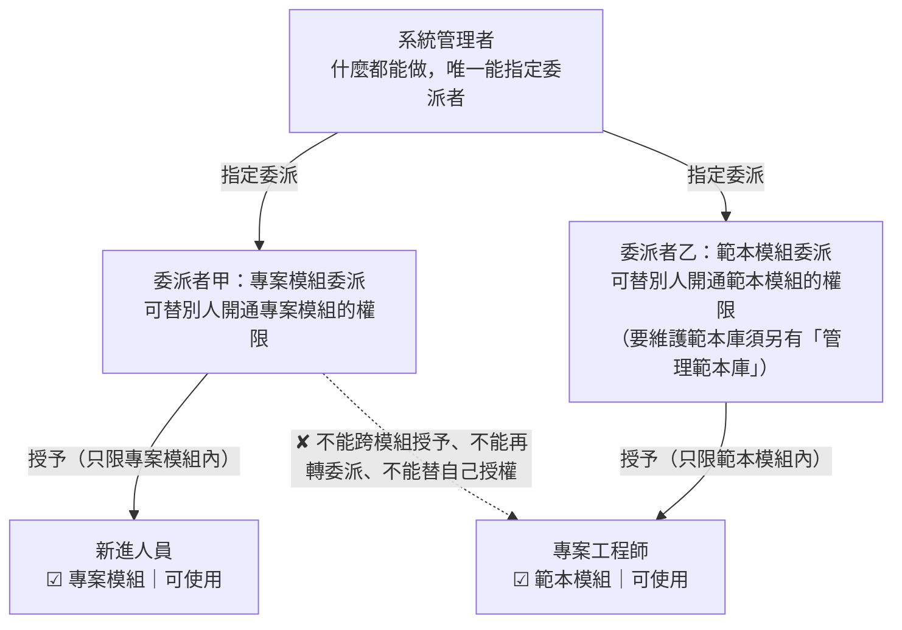

# 權限模型（Permission Model）

**這份文件回答**：誰能做什麼這件事，系統怎麼分層判斷？模組怎麼分工、開專案怎麼接起兩層、新模組怎麼接入、委派怎麼運作，以及為什麼這樣選？
**什麼時候讀**：設計或修改人員、角色、模組權限、委派、開設專案、範本管理權限，或新增一個功能模組（報告、採購等）時。

本文是 [KD-69](03-decisions-and-stack.md#kd-69) 的完整說明：KD-69 記錄決策本身、負責人的 25 項裁定、方案取捨與業界參考備註，本文補上背景、示意圖、判斷順序、新模組接入步驟與方案比較表。兩者有出入時以 KD-69 與 [OQ-08](05-open-questions.md#oq-08) 為準。

**依據**：架構基準 §17；負責人裁定（[#538](https://github.com/speko-tw/inspect-flow/issues/538)，2026-10-09）。方案比較只是整理時的參考，不是依據來源，也不升級為「必須」。

---

## 負責人的想法

- 開專案、管理範本庫、看全部專案進度，都是「逐人給予」的能力，不該綁在角色上；角色只應該存在專案裡（例如專案工程師、現場工程師）。
- 各個功能模組（專案、查核、範本，之後的報告、採購）將來可以各自獨立，新增模組時不必改既有的授權結構。
- 系統管理者什麼都能做，也能把某個模組的授權工作交給特定人員；被委派者只負責替別人開通、收回該模組的權限，不附帶任何編輯能力。

## 兩層模型與模組邊界

權限分兩層，每一層的資料只放在一個模組：

- **第 1 層：人員模組**。唯一來源：身分、帳號、啟用／停用、系統管理者開關，以及逐人勾選的**模組權限**。
- **第 2 層：專案模組**（共用底層）與掛在專案底下的**功能模組**。專案模組管專案、成員、**專案角色**；查核模組（日後還有報告、採購）掛在專案底下，共用同一份專案資料。

兩層之間只有一條單向的詢問線：專案模組向人員模組問，人員模組不需要知道專案的事。

**圖 1　兩層模型與模組邊界。** 上層逐人勾選模組權限；下層在專案裡用角色決定動作；專案模組做權限判斷時只向人員模組問四件事，不直接讀人員資料表或管理者欄位。

規則：

- 角色只存在專案內，是專案內動作權限的套餐；角色定義全系統共用、由系統管理者維護，各專案分別指派。系統不設全公司角色。
- 模組權限**不會**自動給專案內的任何動作權限。人員必須先是專案成員、被指派專案角色，專案內動作（查核項目、計畫與任務、派出、現場查核等）一律由專案角色決定。
- 專案模組只管專案本身（基本資料、成員、角色），專案與查核是兩個模組，用到哪個模組就要有那個模組的使用權。

## 判斷順序

專案外的事（開專案、管理範本庫、看全部專案進度）只看第 1 層；專案內的事兩層都要通過；系統管理者兩層都直接放行（它是人員模組上的一個開關，不是角色）。

**圖 2　判斷流程。** 第 1 層是「能不能用這個模組」，第 2 層是「在這個專案能做什麼」。第 1 層的「可使用」也是專案內動作的總開關，兩層都要通過（裁定第 2 項）。後端預設拒絕，沒有明確授權就拒絕（[KD-29](03-decisions-and-stack.md#kd-29)）。

## 開專案怎麼接起兩層

角色只存在專案裡，但開專案的時候專案還不存在。解法：開專案屬第 1 層的模組權限；專案開好之後，**非管理者**開專案時，系統在**同一個動作**內把建立者加為成員，給預先設定的「建立者角色」（預設「專案工程師」），之後才交給第 2 層。**系統管理者**開專案不自動成為成員（本來就能管理所有專案），但可選填「建立者角色人選」，一步完成交接。

**圖 3　開專案流程。** 建立者不能替自己挑任意角色（避免自行升權），也不會建完卻看不到自己的專案。建立者角色系統一律保留「調整專案」「管理成員」兩項。任一步失敗整筆回滾，不會留下沒有建立者成員的專案（管理者開專案除外，由管理者自行指定建立者角色人選）。

**權限組合**可一鍵勾好第 1 層的項目（預設「專案工程師常用」含開設專案）；組合不是角色，也不存在專案裡；修改組合不追改已套用過的人，避免它變成另一種角色。

## 預建角色與成員指派

系統安裝時預建三個專案角色：「專案工程師」（預設建立者角色，含調整專案、管理成員、建立計畫、派出任務等）、「現場工程師」、「專案查閱人員」（唯讀，0.5.x 看不到照片與查核結果）。Admin 可改名與內容；要刪除目前的建立者角色，須先改設另一個，且新的建立者角色必須具備「調整專案」「管理成員」。

持有管理成員權限的非管理者，只能指派、替換或移除 Admin 事先核准（可指派）的角色（預設「現場工程師」「專案查閱人員」），下拉選單只列可指派的角色，也不能修改自己的角色；後端擋下違規並寫稽核，被擋下的嘗試在獨立交易寫入。

## 外部協作人員

專案工程師可把外部公司人員（業主代表、監造、協力廠商）加入專案，不再限制非管理者只能加同公司人員；外部人員的帳號與模組開通仍由 Admin 負責。規則（負責人 2026-10-10 裁定）：

1. **標記**：Admin 建立帳號時必選「內部」或「外部協作人員」，沒有預設值；外部身分只看這個標記，不看所屬公司；身分同步不得覆蓋此標記。這與外部身分來源帳號（外部帳號）是兩件事。
2. **外部可用角色**：Admin 標記哪些角色「外部可用」，預設只有「專案查閱人員」。替外部人員指派角色時，角色必須外部可用；非管理者另須在可指派白名單內（Admin 不受白名單限制，但仍受外部可用限制，不可破例），後端在所有寫入口（加入成員、改角色、角色編輯、標記切換、模組權限授予、權限組合套用、委派指定、回填）一律檢查。
3. **永遠不給外部人員**：開設專案、管理成員、委派、管理範本庫、系統管理者；建立者角色不得標為外部可用；連 Admin 也不能破例。
4. **只處理指派給自己的任務**：有寫入權的外部角色只能看、開始、完成指派給自己的任務。這個範圍限制完成前，外部人員只給唯讀角色；範圍限制另開範圍變更（[#550](https://github.com/speko-tw/inspect-flow/issues/550)），隨 0.7.x 結果輸入一起做，本模型目前只記規則。
5. **廠商間隔離**：外部寫入角色看得到別人任務的清單與狀態，但打不開內容、照片、缺失紀錄；業主、監造等唯讀角色可看全案（同在 [#550](https://github.com/speko-tw/inspect-flow/issues/550)）。
6. **紀錄身分快照**：每筆紀錄保存寫入當下的「姓名．外部協作人員．單位」，日後人員資料變更不影響；無單位時顯示「外部協作人員（未填單位）」。
7. **帳號到期**：外部人員最後一個專案成員身分被移除時自動停用並寫稽核；Admin 可選填到期日；人員頁列出「目前沒有任何專案的外部人員」；重新啟用照停用與啟用的流程。
8. **改標記或改角色**：外部改內部，確認後放行並寫稽核；內部改外部、或角色取消「外部可用」時擋下，列出不合格的角色與人員（含已停用者），處理完才能存檔。

## 新模組的接入規則

例如日後的報告、採購，每次都照同一套四個步驟，人員模組與專案模組都不用改結構：

1. 新模組宣告自己的**模組權限**項目，第一項通常是「可使用此模組」。
2. 新模組宣告自己的**專案動作權限**項目（如果它有專案內的動作）。
3. 人員頁自動多一列勾選；專案角色的編輯畫面自動多一組可選項目。
4. 後端照現行「預設拒絕、每條路由都要宣告存取層級」，只多一種「需要模組權限」的宣告。

## 委派

系統管理者什麼都能做，也可以把某個模組的授權工作交給特定人員。規則（負責人同意）：

- **以模組為單位**：被委派「專案模組」的人，只能授予專案模組裡的權限，不能跨到範本模組。
- **只能授權，不附帶編輯能力**：委派只代表「可以替別人開通、收回該模組的權限」；例如要維護範本庫，須另勾「管理範本庫」（可用權限組合一次勾選）。
- **不能替自己授權、不能再轉委派**：只有系統管理者能指派與收回委派者，也只有系統管理者能授予「看全部專案進度」。
- **套用權限組合逐項驗權**：任一項超出委派範圍，整組不套用並說明原因，不會只套一半。
- **每次授予與收回都寫稽核紀錄**（含委派的指派與收回）。

**圖 4　委派。** 被委派的人只能在自己被委派的模組裡授權；每次授予與收回都留紀錄。

## 方案比較（已採用 A）

| | A　逐人模組權限＋專案角色（採用） | B　全公司角色＋專案角色 | C　一份混合角色（角色同時含開專案與派任務） |
|---|---|---|---|
| 管理負擔 | 低：每人幾個勾選；人多時用權限組合批次套用 | 中：要維護兩份角色清單，給人前先分清是哪一種 | 中低：一份清單，但每次都要想哪些項目在這裡生效 |
| 好不好懂 | 高：「人員頁勾模組、專案頁選角色」 | 中低：同名角色可能出現兩次，也不符合「角色只在專案」 | 中：貼近「專案工程師含開專案」的說法，但「給了角色卻有些項目不生效」容易困惑 |
| 將來模組獨立 | 最佳：人員資料全在人員模組，角色全在專案模組 | 可以：全公司角色放人員模組 | 差：一張角色表橫跨兩個模組，拆分時要拆表 |
| 加新模組 | 好：照四步驟 | 中：每個新權限要先判斷放哪種角色 | 中低：清單越長越亂 |
| 改動成本 | 低：只有範本管理權限一處要改成模組權限 | 高：全公司角色要整套新建（資料表、API、畫面、影響預覽） | 中：要在權限清單標範圍、做「在此生效」過濾 |

不採 B、C 的理由見 [KD-69](03-decisions-and-stack.md#kd-69)「考慮過但沒選」。

## 待確認的細節

以下尚未經負責人裁定，定案後更新 [KD-69](03-decisions-and-stack.md#kd-69) 與相關規格：

- 範本模組管理者從專案「存成範本」時，可以看到哪些專案的清單（正式條件待確認）。
- 報告模組的權限項目，等 0.8.x 正式報告的規格再定。
