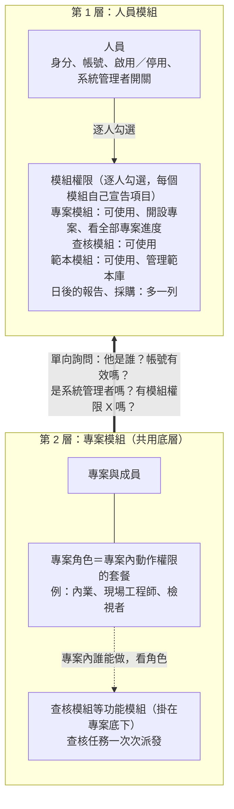
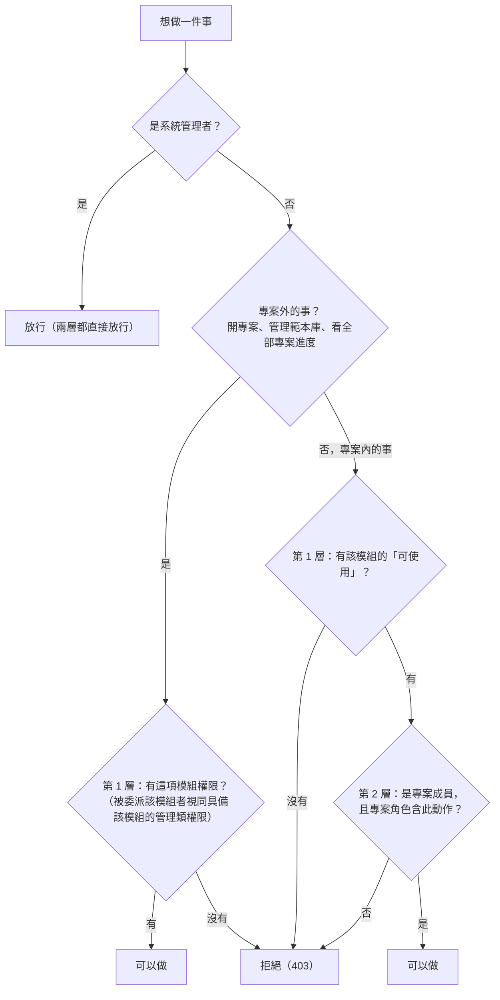
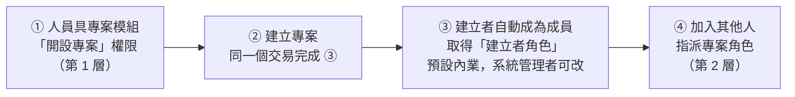
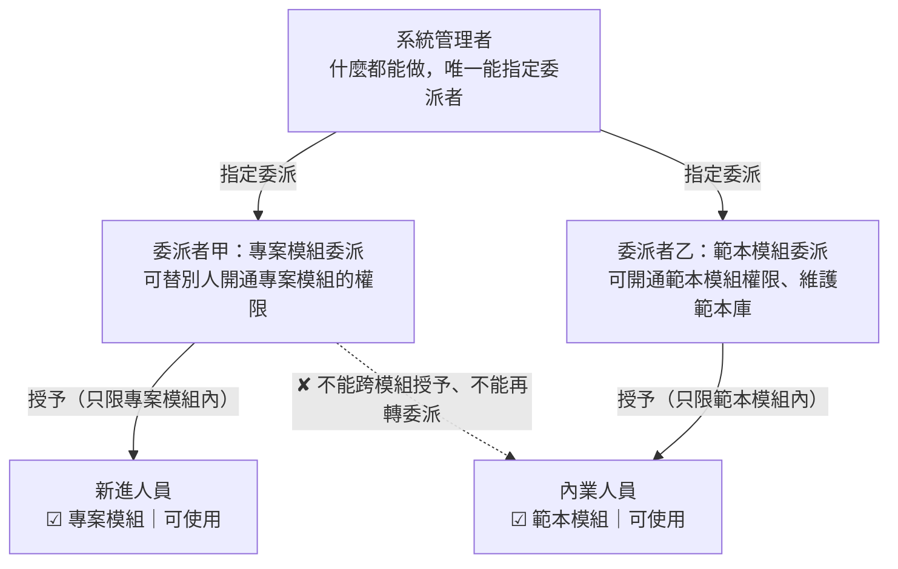

# 權限模型（Permission Model）

**這份文件回答**：誰能做什麼這件事，系統怎麼分層判斷？模組怎麼分工、開專案怎麼接起兩層、新模組怎麼接入、委派怎麼運作，以及為什麼這樣選？
**什麼時候讀**：設計或修改人員、角色、模組權限、委派、開設專案、範本管理權限，或新增一個功能模組（報告、採購等）時。

本文是 [KD-69](03-decisions-and-stack.md#kd-69) 的完整說明：KD-69 記錄決策本身、九項裁定、委派規則、方案取捨與業界參考備註，本文補上背景、示意圖、判斷順序、新模組接入步驟與方案比較表。兩者有出入時以 KD-69 與 [OQ-08](05-open-questions.md#oq-08) 為準。

**依據**：架構基準 §17；負責人裁定（[#538](https://github.com/speko-tw/inspect-flow/issues/538)，2026-10-09）。方案比較只是整理時的參考，不是依據來源，也不升級為「必須」。

---

## 負責人的想法

- 開專案、管理範本庫、看全部專案進度，都是「逐人給予」的能力，不該綁在角色上；角色只應該存在專案裡（例如內業、現場工程師）。
- 各個功能模組（專案、查核、範本，之後的報告、採購）將來可以各自獨立，新增模組時不必改既有的授權結構。
- 負責人原話：「系統管理員當然什麼都可以做，但他可以授予一些人權限，讓他們可以做某些、也可以做模組的編輯的動作。」

## 兩層模型與模組邊界

權限分兩層，每一層的資料只放在一個模組：

- **第 1 層：人員模組**。唯一來源：身分、帳號、啟用／停用、系統管理者開關，以及逐人勾選的**模組權限**。
- **第 2 層：專案模組**（共用底層）與掛在專案底下的**功能模組**。專案模組管專案、成員、**專案角色**；查核模組（日後還有報告、採購）掛在專案底下，共用同一份專案資料。

兩層之間只有一條單向的詢問線：專案模組向人員模組問，人員模組不需要知道專案的事。

**圖 1　兩層模型與模組邊界。** 上層逐人勾選模組權限；下層在專案裡用角色決定動作；專案模組做權限判斷時只向人員模組問四件事，不直接讀人員資料表或管理者欄位。

規則：

- 角色只存在專案內，是專案內動作權限的套餐；角色定義全系統共用、由系統管理者維護，各專案分別指派。系統不設全公司角色。
- 模組權限**不會**自動給專案內的任何動作權限。人員必須先是專案成員、被指派專案角色，專案內動作（查核項目、計畫與任務、派出、現場查核等）一律由專案角色決定。
- 專案模組只管專案本身（基本資料、成員、角色），專案與查核是兩個模組，用到哪個模組就要有那個模組的使用權。

## 判斷順序

專案外的事（開專案、管理範本庫、看全部專案進度）只看第 1 層；專案內的事兩層都要通過；系統管理者兩層都直接放行（它是人員模組上的一個開關，不是角色）。

**圖 2　判斷流程。** 第 1 層是「能不能用這個模組」，第 2 層是「在這個專案能做什麼」。第 1 層的「可使用」也是專案內動作的總開關，兩層都要通過（裁定第 2 項）。後端預設拒絕，沒有明確授權就拒絕（[KD-29](03-decisions-and-stack.md#kd-29)）。

## 開專案怎麼接起兩層

角色只存在專案裡，但開專案的時候專案還不存在。解法：開專案屬第 1 層的模組權限；專案開好之後，系統在**同一個動作**內把建立者加為成員，給預先設定的「建立者角色」，之後才交給第 2 層。

**圖 3　開專案流程。** 建立者不能替自己挑任意角色（避免自行升權），也不會建完卻看不到自己的專案。任一步失敗整筆回滾，不會留下沒有建立者成員的專案。

負責人提到「內業包含開專案」：做法是用選配的**權限組合**一鍵勾好第 1 層的項目（例如「內業常用」），組合不叫角色，也不存在專案裡；修改組合不追改已套用過的人，避免它變成另一種角色。

## 新模組的接入規則

例如日後的報告、採購，每次都照同一套四個步驟，人員模組與專案模組都不用改結構：

1. 新模組宣告自己的**模組權限**項目，第一項通常是「可使用此模組」。
2. 新模組宣告自己的**專案動作權限**項目（如果它有專案內的動作）。
3. 人員頁自動多一列勾選；專案角色的編輯畫面自動多一組可選項目。
4. 後端照現行「預設拒絕、每條路由都要宣告存取層級」，只多一種「需要模組權限」的宣告。

## 委派

系統管理者什麼都能做，也可以把某個模組的授權工作交給特定人員。規則（負責人同意）：

- **以模組為單位**：被委派「專案模組」的人，只能授予專案模組裡的權限，不能跨到範本模組；被委派者也能做該模組的編輯動作（例如被委派範本模組的人可以維護範本庫）。
- **不能再轉委派**：只有系統管理者能指派與收回委派者。
- **每次授予與收回都寫稽核紀錄**（含委派的指派與收回）。

**圖 4　委派。** 被委派的人只能在自己被委派的模組裡授權；每次授予與收回都留紀錄。

## 方案比較（已採用 A）

| | A　逐人模組權限＋專案角色（採用） | B　全公司角色＋專案角色 | C　一份混合角色（角色同時含開專案與派任務） |
|---|---|---|---|
| 管理負擔 | 低：每人幾個勾選；人多時用權限組合批次套用 | 中：要維護兩份角色清單，給人前先分清是哪一種 | 中低：一份清單，但每次都要想哪些項目在這裡生效 |
| 好不好懂 | 高：「人員頁勾模組、專案頁選角色」 | 中低：同名「內業」可能出現兩次，也不符合「角色只在專案」 | 中：貼近「內業含開專案」的說法，但「給了角色卻有些項目不生效」容易困惑 |
| 將來模組獨立 | 最佳：人員資料全在人員模組，角色全在專案模組 | 可以：全公司角色放人員模組 | 差：一張角色表橫跨兩個模組，拆分時要拆表 |
| 加新模組 | 好：照四步驟 | 中：每個新權限要先判斷放哪種角色 | 中低：清單越長越亂 |
| 改動成本 | 低：只有現行「範本管理員」一張表要轉換 | 高：全公司角色要整套新建（資料表、API、畫面、影響預覽） | 中：要在權限清單標範圍、做「在此生效」過濾 |

不採 B、C 的理由見 [KD-69](03-decisions-and-stack.md#kd-69)「考慮過但沒選」。

## 過渡期

規格合併到程式完成前，行為維持 v0.3.x：只有系統管理者能開設專案，範本管理員（`template_admin`）照舊。程式完成後，`template_admin` 逐人轉成範本模組「管理範本庫」，轉換期間不得失去有效權限，前後逐人比對。

## 待確認的細節

以下是改寫規格時暫定、尚未經負責人逐項裁定的細節；完整清單與選項、建議見 [KD-69](03-decisions-and-stack.md#kd-69) 與 `domain-model` 規格 DOM-Q10～DOM-Q15，定案後更新 KD-69 與相關規格：

- 範本模組管理者從專案「存成範本」時，可以看到哪些專案的清單（過渡期維持現行的列全部專案；正式條件待確認）。
- 預設權限組合「公司主管」的內容（暫定為專案模組「可使用」「看全部專案進度」加查核模組「可使用」）；看全部專案進度的任務明細是否另需查核模組「可使用」。
- 建立者角色空值時怎麼辦、Admin 開專案是否自動成為成員、建立者角色是否含調整專案與管理成員、開設專案是否蘊含專案模組「可使用」、上線時是否為既有成員自動開通「可使用」。
- 專案模組與查核模組的委派者目前只能授予與收回權限，不能修改專案。
- 報告模組的權限項目，等 0.8.x 正式報告的規格再定。
- 模組權限的代碼命名（沿用「資料.動作」格式，模組另用欄位表達）、權限組合由誰維護、建立者角色未設定時的處理。

## 程式端要做的事

排入 0.5.x：新增人員模組權限、權限組合與委派資料；範本管理員轉換；建專案改看模組權限並同一交易加入建立者；使用者管理頁加模組權限勾選、常用組合與委派設定，加入成員時提示未開通模組；收斂三處跨邊界寫法（登入者權限摘要由專案角色推算 `services/access_summary.py`、專案 API 直接查人員與公司表 `api/v1/projects.py`、專案服務直接讀管理者欄位 `services/inspection_planning.py`）。
