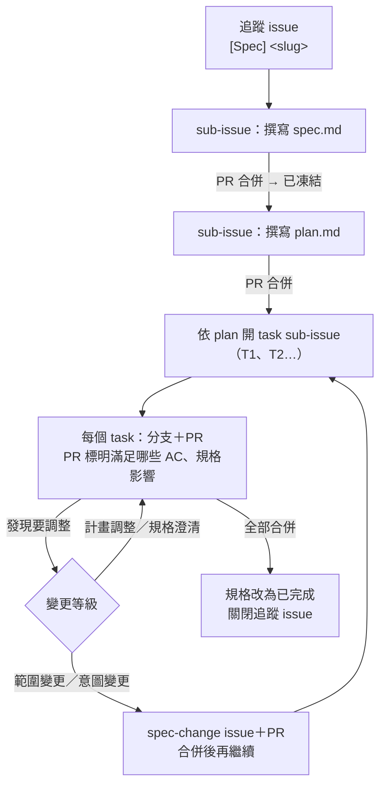

# 規格文件（Specs）

**這份文件回答**：規格（spec）與計畫（plan）怎麼寫、怎麼對應到 GitHub issue 與 PR，做到一半要改規格時怎麼處理。
**什麼時候讀**：開始一個 Phase 的工作、拆 task、寫 PR，或發現規格需要調整時。

> **用語**：本文的「任務」「計畫」「範本」「狀態」都指開發流程（GitHub task、`plan.md`、文件與 issue 範本、規格文件狀態），不是 [04-glossary.md](../intents/04-glossary.md) 裡的 `Inspection Task`、`Inspection Plan`、`Inspection Template`／`Report Template` 或實體狀態。撰寫 `inspection-planning`、`template-system` 等規格時，領域實體一律寫英文實體名。

## 四層文件

每一層都從上一層已核准的內容推導出來，只引用上一層，不重抄內容。

| 層 | 位置 | 回答什麼 | 誰同意 | 多久會變 |
|---|---|---|---|---|
| 意圖 | [`docs/intents/`](../intents/README.md) | 為什麼這樣設計、哪些規則不能違反、哪些還沒定 | 團隊 | 很少 |
| 規格 | `docs/specs/<slug>/spec.md` | 這塊能力做完是什麼樣子：範圍、需求、介面、驗收條件 | 團隊 | 發現問題才改 |
| 計畫 | `docs/specs/<slug>/plan.md` | 怎麼拆成 task：改哪些檔案、依賴、哪些可並行、風險、怎麼證明做完 | 負責工程師 | 實作中隨時調整 |
| 任務 | GitHub sub-issue | 這一次要交付哪一小塊 | PR 審查者 | 每天 |

一份規格對應多個任務；一個任務對應一個分支、一個 PR，而且不跨兩份規格。

## 目錄

```text
docs/specs/
├── README.md              本檔：流程、規格索引、共用檔案規則
├── _templates/
│   ├── spec.md
│   └── plan.md
└── <slug>/                一份規格一個資料夾，開始寫時才建立
    ├── spec.md
    └── plan.md
```

- 資料夾以能力命名（例如 `skeleton`、`template-system`），不放 Phase 編號。Phase 可能拆分或合併，名稱不必跟著改；對應關係記在下方索引。
- 共用規格（`api-conventions`、`domain-model`、`state-machines`）也是一般規格，只是會被多份規格引用。

<a id="index"></a>
## 規格索引

索引是全貌規劃，不代表現在就要寫。「被擋議題」裁定前，該規格只能寫到草稿。

| 規格 | Phase | 類型 | 狀態 | 追蹤 issue | 被擋議題 |
|---|---|---|---|---|---|
| `skeleton` | P0 | 功能 | 未開始 | [#5](https://github.com/speko-tw/inspect-flow/issues/5) | — |
| `api-conventions` | 全部 | 共用 | 未開始 | — | — |
| `database-foundation` | P1 | 功能 | 未開始 | — | — |
| `domain-model` | P1、P3、P4、P6、P9 | 共用 | 未開始 | — | [G-01](../intents/05-open-questions.md#g-01)、[G-02](../intents/05-open-questions.md#g-02)、[OQ-06](../intents/05-open-questions.md#oq-06)；不受影響的實體能否先凍結見 [OQ-22](../intents/05-open-questions.md#oq-22) |
| `state-machines` | P4、P6、P7、P9 | 共用 | 未開始 | — | [OQ-09](../intents/05-open-questions.md#oq-09)、[G-06](../intents/05-open-questions.md#g-06) |
| `authentication` | P2 | 功能 | 未開始 | — | [OQ-13](../intents/05-open-questions.md#oq-13)、[OQ-08](../intents/05-open-questions.md#oq-08) |
| `template-system` | P3 | 功能 | 未開始 | — | [G-01](../intents/05-open-questions.md#g-01)、[OQ-06](../intents/05-open-questions.md#oq-06) |
| `inspection-planning` | P4 | 功能 | 未開始 | — | [G-01](../intents/05-open-questions.md#g-01) |
| `field-ui` | P5 | 功能 | 未開始 | — | [OQ-09](../intents/05-open-questions.md#oq-09) |
| `field-evidence` | P6 | 功能 | 未開始 | — | [G-02](../intents/05-open-questions.md#g-02)、[G-03](../intents/05-open-questions.md#g-03)、[G-05](../intents/05-open-questions.md#g-05)、[OQ-14](../intents/05-open-questions.md#oq-14)、[OQ-17](../intents/05-open-questions.md#oq-17) |
| `completion-validation` | P7 | 功能 | 未開始 | — | [OQ-06](../intents/05-open-questions.md#oq-06) |
| `admin-dashboard` | P8 | 功能 | 未開始 | — | — |
| `report-delivery` | P9 | 功能 | 未開始 | — | [G-04](../intents/05-open-questions.md#g-04)、[G-06](../intents/05-open-questions.md#g-06)、[G-07](../intents/05-open-questions.md#g-07)、[OQ-07](../intents/05-open-questions.md#oq-07)、[OQ-11](../intents/05-open-questions.md#oq-11)、[OQ-15](../intents/05-open-questions.md#oq-15) |
| `pilot-deployment` | P10 | 功能 | 未開始 | — | [OQ-18](../intents/05-open-questions.md#oq-18)、[G-09](../intents/05-open-questions.md#g-09) |

## 狀態

| 狀態 | 意思 | 什麼時候改 |
|---|---|---|
| 未開始 | 只在索引上，還沒有資料夾 | — |
| 草稿 | 正在寫，或被議題擋住 | 撰寫規格的 PR 開出時 |
| 已凍結 | 可以據此寫計畫、拆任務的基準；**不是不能改**，改動依[變更規則](#change) | 撰寫規格的 PR 合併時 |
| 已完成 | 所有任務都已合併，驗收條件都有對應的測試或驗證 | 最後一個任務的 PR 內一併修改 |
| 已取代 | 被拆分、合併或重寫，內容改由其他規格負責 | 取代它的規格合併時 |

狀態只在 PR 裡改，並同步更新本檔索引。「實作中」不另設狀態，看追蹤 issue 的 sub-issue 進度即可。

## 流程與 GitHub 對應



1. **開追蹤 issue**：用 `Spec tracking` 範本，標題 `[Spec] <slug>`，掛 milestone。規格的工作清單就是它的 sub-issue 列表。
2. **撰寫規格**：第一個 sub-issue。規格用 plan mode 或對談整理，只寫「做完長什麼樣子」，不寫怎麼做。
3. **撰寫計畫**：規格凍結後才寫，從規格推導。小規格（例如 `skeleton`）可以和上一步在同一個 PR 完成。
4. **開任務**：依 plan 的 T 編號逐一開 `Task` sub-issue，填寫計畫項目（T 編號）、涵蓋的驗收條件與「依賴」。
5. **實作**：分支 `<issue 編號>-<簡短描述>`，一個任務一個 worktree。PR 用範本填寫滿足的 AC 與規格影響，`Closes #<task issue>`。
6. **收尾**：最後一個任務的 PR 把規格改為「已完成」並更新索引；追蹤 issue 隨之關閉。

計畫只記「為什麼這樣拆」；進度只看 issue，不回頭在計畫裡打勾。

### 不屬於任何規格的工作

流程、工具、文件整理這類工作（例如建立本流程的 #3）不產生產品行為，不必寫規格和計畫：直接開一般 issue，不掛在追蹤 issue 底下，PR 範本的「規格」段寫 `N/A`。做著做著發現它其實會改變產品行為，就改走規格流程。

<a id="human-gates"></a>
## 自動化與人的關卡

判斷與實作由 agent 自動推進；決定與核准留給人。

**agent 自動做**：挑下一個可開工的任務（依本檔索引與 issue 的「依賴」欄，跳過 `blocked`）→ 讀規格與計畫 → 在自己的 worktree 實作 → 跑驗證、失敗自行修正 → 判斷變更等級 → 依 PR 範本開 PR → PR 合併後更新規格狀態與索引。

**留給人的關卡**：

| 關卡 | 人做什麼 | agent 在等待時 |
|---|---|---|
| 合併 PR | 審查後合併到 `main`。規格 PR 合併即「凍結」：確認這份規格可以作為拆任務與驗收的基準 | 改做不依賴該 PR 的其他任務，不停下來等 |
| `needs-decision` | 團隊討論範圍變更、意圖變更、OQ／G 裁定 | 在 issue 整理選項與影響；受影響的任務標 `blocked`，改做其他任務 |
| 破壞性或全域操作 | 核准 force push、刪除、新增 label、repo 設定 | 先詢問，不自行執行 |

人每天只需要看兩處：待審查的 PR，以及 `label:needs-decision` 的 issue。

**閉環前提**：agent 要能自行證明「做完了」，人也要能有效率地審查，因此 `skeleton` 規格**必須**建立：

- CI：每個 PR 跑格式檢查、lint、測試與 build；失敗不得合併。
- 統一的測試指令：本機與 CI 用同一個入口。
- 程式碼格式規範：formatter 與 linter 設定進版控，行寬上限 80 字元（見 [程式品質工具](../intents/03-decisions-and-stack.md#stack-code-quality)）。
- 程式碼審查：PR 開出時自動產生審查意見，並有一份審查準則說明查什麼、哪些算必修；最後仍由人核准合併。
- `main` 的分支保護：需審查、CI 通過才能合併。

**規範怎麼長出來**：`skeleton` 只放最小可用的格式與審查規則；之後在審查中發現值得固定的規則，由發現的 PR 直接補進準則。會引起爭議或影響既有程式碼的規則（例如換 formatter、改命名慣例），開 issue 標 `needs-decision` 討論。

<a id="change"></a>
## 變更規則（保留彈性）

規格和計畫是**目前最好的理解，不是合約**。做到一半發現更好的做法就改，但改動必須留在 Git 裡，並讓該同意的人看到。

| 等級 | 例子 | 怎麼改 | 誰同意 |
|---|---|---|---|
| **計畫調整** | 拆分或合併任務、改順序、改動的檔案不同、換實作方式 | 在當下任務的 PR 裡更新 `plan.md`，並調整 sub-issue | 負責工程師 |
| **規格澄清** | 補細節、修措辭、讓 AC 更精確；行為與範圍不變 | 在當下任務的 PR 裡更新 `spec.md`，PR 範本的規格影響填「規格澄清」 | PR 審查者 |
| **範圍變更** | 增刪需求或 AC、改 API 契約、需求移到其他規格 | 先開 `Spec change` issue 與 PR，合併後再改程式碼；受影響的規格一起更新 | 團隊 |
| **意圖變更** | 牴觸「必須」原則、新增或修改 KD、裁定 OQ／G | 依 [AGENTS.md](../../AGENTS.md)：先改 `docs/intents/`，再回頭更新受影響的規格 | 團隊 |

- **拿不準等級時，往高一級處理。**
- **不默默刪除**：撤回的需求或 AC 保留編號，標「撤回」並附原因與連結；移到其他規格的標「移至 `<slug>`」。編號不重複使用。
- **變更紀錄**：範圍變更以上，在規格末尾「變更紀錄」加一行「改了什麼 — #issue」。細節以 Git 為準，不標版本號。
- **方向整個錯了**：規格退回「草稿」；未開始的任務 issue 以 *not planned* 關閉並說明原因。已合併的程式碼不回滾，由新的計畫處理。
- **拆分或合併規格**：建立新資料夾，舊規格改為「已取代」並指向新規格，同步更新索引。
- **議題被裁定**：這屬於意圖變更。`05-open-questions.md` 更新後，把索引中被它擋住的規格逐一檢查、更新。

<a id="parallel"></a>
## 並行開發

**同一份規格內**：計畫依「改動的檔案」分波。檔案不重疊的任務可以同一波並行；會碰到同一批檔案的任務依序做。

**跨規格**：任務之間的依賴寫在 issue 的「依賴」欄，不看 Phase 編號。例如 `database-foundation` 的 Alembic 初始化只依賴 `skeleton` 的後端骨架，不必等 `skeleton` 的 CI。

**共用檔案規則**：以下檔案全專案只有一份，任何計畫列出改動檔案時都要檢查是否碰到：

| 共用檔案 | 規則 |
|---|---|
| Alembic migration 鏈 | 每個 PR 最多新增一支 migration；後合併的一方先 rebase，並把 `down_revision` 改接到最新 head，不留多個 head |
| lockfile（Python、前端） | 新增或升級套件的 PR 先合併，其他分支再 rebase 並重新產生 lockfile，不手動合併衝突 |
| 共用規格（`api-conventions`、`domain-model`、`state-machines`） | 各規格只改自己負責的段落；新增共用慣例要開獨立任務 |
| 應用程式入口、router 註冊、設定檔 | 每個模組自己一個檔案，入口只加一行註冊 |

<a id="github-taxonomy"></a>
## GitHub 分類

原則：GitHub 已有原生功能的就用原生功能，label 只表達原生功能做不到的「改動範圍」與「例外狀態」。GitHub 上的 label 必須與本節一致。

**原生功能負責的事**：

| 要表達什麼 | 用什麼 |
|---|---|
| 類型 | Issue Type：`Feature`＝規格的追蹤 issue、`Task`＝任務（含不屬於規格的工作）、`Bug`＝缺陷 |
| 屬於哪份規格、哪個 Phase | sub-issue 的上層 `Feature` issue，以及本檔[規格索引](#index) |
| 版本 | Milestone（例如 `0.1.x`） |
| 進度 | open／closed 與關聯的 PR；需要看板時再用 Projects |
| 重複、不做 | 關閉原因：duplicate、not planned |
| 優先順序 | Milestone 與排序；需要時用 Projects 欄位，不用 label |

**Label（固定 7 個）**：

| Label | 用途 | 規則 |
|---|---|---|
| `area: intents` | `docs/intents/` | 可複選，依實際改動範圍標記 |
| `area: specs` | `docs/specs/` | 同上 |
| `area: backend` | 後端程式碼 | 同上 |
| `area: frontend` | 前端程式碼 | 同上 |
| `area: infra` | CI、Docker、部署、repo 設定與範本 | 同上 |
| `blocked` | 在等 OQ／G 裁定或其他 issue | 內文寫明原因；解除後移除 |
| `needs-decision` | 需要團隊拍板（範圍變更、意圖變更） | 拍板後移除 |

**範本預設**：

| 範本 | Issue Type | 預設 label |
|---|---|---|
| Spec tracking | `Feature` | 無（area 標在底下的任務） |
| Task | `Task` | 無（開單者依範圍選 area） |
| Spec change | `Task` | `area: specs`、`needs-decision` |
| Bug | `Bug` | 無（開單者依範圍選 area） |

**新增 label** 只限兩種情況：出現新的程式碼範圍（例如新的頂層目錄），或出現原生功能做不到的例外狀態。新增前先開 issue 說明理由，並在同一個 PR 更新本節。

## 編號

| 對象 | 格式 | 範例 | 說明 |
|---|---|---|---|
| 需求 | `<代碼>-R<nn>` | `SKL-R01` | 代碼是 3 個大寫英文字母，寫在規格標頭，全專案唯一 |
| 驗收條件 | `<代碼>-AC<nn>` | `SKL-AC01` | PR 說明與測試引用這個編號 |
| 任務 | `T<n>` | `T3` | 只在同一份計畫內唯一；對應的 issue 編號寫在 issue 內 |

## 範本

- [`_templates/spec.md`](_templates/spec.md)
- [`_templates/plan.md`](_templates/plan.md)
- GitHub issue 範本：`.github/ISSUE_TEMPLATE/`（Spec tracking、Task、Spec change、Bug）
- PR 範本：`.github/pull_request_template.md`
